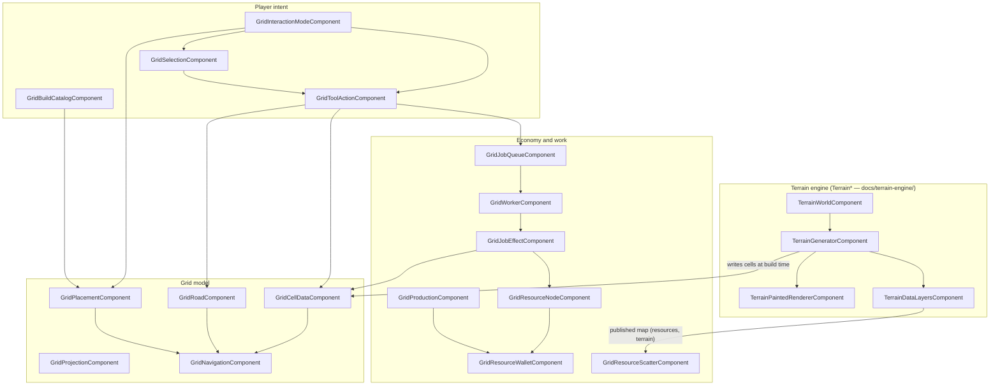
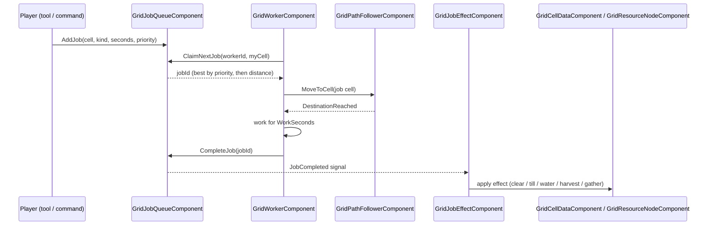
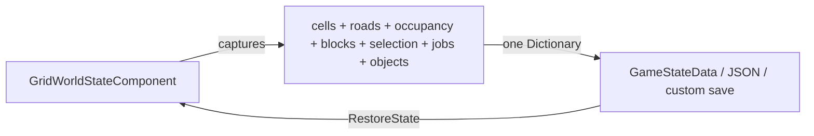

# Beep 2D And Isometric Toolkit

Developer guide for the gameplay-grid system in `addons/beep_game_builder_cs/ecs/grid/` (builder panels under `ecs/grid/ui/`) — the `Grid*` components that builder, farming, settlement, and tactical scenes are assembled from. Refreshed by hand against the source tree on 2026-09-02, after the `Terrain*`/`Grid*` rename and the directory split: `Terrain*` classes are the map/terrain engine in `ecs/terrain/` (documented in `docs/terrain-engine/`), `Grid*` classes are this toolkit, and the two meet through the shared `ResourceCatalog` and the terrain data layers.

## Design Rules

1. Author the visible scene in Godot first. Use `Node2D`, `TileMapLayer`, `CanvasLayer`, `Control`, `Button`, and `Label` nodes that are visible at design time.
2. Attach Beep components as behavior nodes. Set exported `NodePath` fields in the Inspector instead of creating whole HUD panels at runtime.
3. Keep generated UI as an explicit fallback only. HUD components such as `GridToolPaletteComponent` and `GridWorkerSpawnerPanelComponent` bind authored controls by default and only build their own when `GenerateControlsWhenPathsEmpty` is enabled.
4. Keep grid state cell-based. Isometric projection changes how cells are drawn, not how jobs, resources, workers, or saves are modeled.
5. One owner per fact. Where a resource occurs and what gathering it pays lives in the shared `ResourceCatalog`; which cell holds a deposit lives on the node standing there. A component that also stored someone else's fact would drift from it.
6. Every component resolves its collaborators the same way: an exported `NodePath` when set, otherwise a scene-wide search for the first matching component. Wire the paths in real scenes; rely on the search only in prototypes.

## Architecture



The model layer holds facts about cells; the economy layer changes them through jobs; the player layer only expresses intent. HUD panels observe and command — they never own state.

## Starter Scene Layout

The addon template `addons/beep_game_builder_cs/templates/scenes/grid_world_2d_iso.tscn` is the reference assembly:

```text
GridWorld2DIso : Node2D
  Splat : Node2D                      (TerrainPaintedRendererComponent — painted terrain base)
  VisualTileLayer : TileMapLayer      (optional detail/collision sync target)
  TileMapBridge : Node                (GridTileMapLayerBridgeComponent)
  Grid : Node2D                       (GridProjectionComponent)
  Cells : Node                        (GridCellDataComponent)
  TerrainGenerator : Node             (TerrainGeneratorComponent — fills Cells at build time)
  Roads : Node2D                      (GridRoadComponent)
  Selection : Node2D                  (GridSelectionComponent)
  Placement : Node2D                  (GridPlacementComponent)
  Navigation : Node                   (GridNavigationComponent)
  Jobs : Node                        (GridJobQueueComponent)
  JobEffects : Node                   (GridJobEffectComponent)
  Calendar : Node                     (GridCalendarComponent)
  Crops : Node                        (GridCropCatalogComponent)
  Objectives : Node                   (GridObjectiveTrackerComponent)
    ObjectiveEvents : Node            (GridObjectiveEventBinderComponent)
  Commands : Node
    InteractionMode : Node            (GridInteractionModeComponent)
    Tools : Node                      (GridToolActionComponent)
    ClearLandCommand : Node           (GridSelectionJobCommandComponent)
  Buildings / ProductionBuildings : Node2D   (placed objects; each carries GridObjectComponent)
  ResourceNodes : Node2D              (GridResourceScatterComponent + authored GridResourceNodeComponent props)
  Base : Node2D
    WorkerSpawner : Node              (GridWorkerSpawnerComponent)
  State : Node                        (GridWorldStateComponent)
  Units : Node2D                      (spawned workers: GridPathFollowerComponent + GridWorkerComponent)
  Camera2D
    GridCameraController : Node       (GridCameraControllerComponent)
  HUD : CanvasLayer                   (authored panels, see HUD section)
```

For a scene that builds a full procedural world rather than filling flat cells, put a `TerrainWorldComponent` in front: it drives `TerrainGeneratorComponent` from the map-setup axes, rebuilds the renderers, and `TerrainDataLayersComponent` publishes the result as queryable tile data. See `docs/terrain-engine/DEVELOPER_GUIDE.md`.

## Terrain And Projection

`TerrainGeneratorComponent` builds the deterministic terrain field and, through `CellDataPath`, writes one terrain kind per cell into `GridCellDataComponent` at build time. The grid system then works from the cells; it never reaches back into generation.

`TerrainPaintedRendererComponent` draws the terrain as one continuous shader-blended surface (the template's `Splat` node). It is the broad-map visual base; tile layers above it stay free for collision, roads, crops, and feedback.

`TerrainDataLayersComponent` publishes the generated map as invisible `TileMapLayer`s carrying custom tile data (terrain, resource, feature, relief, is_water, passable, continent, start_position, liquid_resource, and underground_resource with richness and depth), plus native per-ground collision and navigation polygons. Point `GridResourceScatterComponent.DataLayersPath` at it and deposits are placed where the map actually put resources. Navigation, placement, and tools also accept a `DataLayersPath`: when wired, they read terrain kinds from the generated map, falling back to cell data where the layers have no tile. `ContinentAt` returns the landmass id (0 means water or off-map), `IsStartPositionAt`/`StartCells` expose the generator's recommended starts.

`TerrainWorldComponent` is the map/world creation front door: shape, size, age, temperature, rainfall, sea level, and resource axes in, a generated and drawn world out.

`GridProjectionComponent` owns the conversion between world positions and cells. Set `Projection` to top-down or isometric and set `TileSize`; placement, selection, cursor, pathing, minimap, and workers all share the same projection. It can also draw a debug grid and track the hovered cell.

`GridNavigationComponent` is cell-based A*. It reads four sources when finding a path: its own blocked set (buildings write into it), `GridCellDataComponent` blocked flags and `BlockedTerrainKinds`, `GridPlacementComponent` occupancy, and `GridRoadComponent` cost multipliers. `TerrainCostMultipliers` price sand, mud, snow, ice, rock, and shallow water; `shallow_water` is deliberately absent from its blocked list — units wade at 2.5x cost while nothing may be *built* there (the build-side components block it by default).

`GridTileMapLayerBridgeComponent` mirrors cell state and road state into a real Godot `TileMapLayer` when a project wants authored tiles to show map state. It listens to cell and road change signals; bulk loads repaint once through `CellsChanged`.

`GridCellOverlayComponent` draws cleared/tilled/watered/planted/harvest-ready/blocked cell fills before a project has TileMap art for every state.

`GridMinimapComponent` renders a compact overview of roads, jobs, selection, units, and the camera view rectangle, over an optional baked terrain background (`ShowTerrain`, colored per terrain kind from cell data).

`GridCameraControllerComponent` gives a `Camera2D` drag pan, wheel zoom at cursor, keyboard/edge pan, world bounds clamping, and focus helpers.

## Cells, Crops, Roads, And Calendar

`GridCellDataComponent` is the per-cell model: terrain kind, `CellFlags` (Blocked, Cleared, Tilled, Watered, Planted, HarvestReady), crop id, growth age, regrow interval, and small metadata — no TileMap required. Single edits emit `CellChanged`; bulk loads emit one `CellsChanged`. Harvesting a crop planted with a regrow interval resets its growth clock instead of clearing it (`RemoveCrop` uproots it regardless); the interval round-trips through saves as `crop_regrow_days`.

`GridCropDefinition` describes a crop: maturity days, allowed seasons, regrow behavior, seed and yield items. `GridCropCatalogComponent` looks crops up for the plant tool and season checks and exposes `RegrowDays`/`SeedItem` alongside `DaysToMature`/`YieldItem`.

`GridCalendarComponent` advances days, seasons, and years — from real seconds or an end-day button — and ticks crop growth in the cell data. `GridCalendarHudComponent` shows the date, day progress, and an optional next-day button.

`GridRoadComponent` stores player-built road cells with traversal cost multipliers and draws them. It rejects roads on blocked cells or blocked terrain, and navigation multiplies road cost with terrain cost, so a dirt path over slow ground still helps.

## Selection, Interaction, And Placement

`GridInteractionModeComponent` coordinates who consumes a map click: Select, Inspect, Tool, Build, or Disabled. It takes over mouse input from the child systems (`ManageChildMouseInput`) so one click has one meaning.

`GridSelectionComponent` handles hover, click, and drag-rectangle cell selection.

`GridInteractionModeBarComponent` is the authored mode button bar; `GridInteractionStatusComponent` shows the active mode, hovered or placement cell, and the latest applied/rejected feedback; `GridInteractionCursorComponent` draws the mode-colored cell cursor, green/red during placement.

`GridToolActionComponent` applies the selected tool — Clear, Hoe, Water, Plant, Harvest, QueueJob, Road, RemoveRoad — to a clicked cell or the whole selection. It checks blocked flags, blocked/allowed terrain, season (through the crop catalog and calendar), and pays harvest yield into the wallet. Planting charges the crop's `SeedItemId` from the wallet (one seed per cell; `missing_seeds` when short; `ConsumeSeedsFromWallet` opts out; no wallet in the scene means no charge) and passes the crop's regrow interval through to the cell data.

`GridPlacementComponent` runs build placement: preview under the mouse, footprint validity, click to confirm, right-click or Escape to cancel. On confirm it can charge the wallet, stamps a `GridObjectComponent` onto the placed scene, marks footprint cells occupied, and blocks them in navigation.

### Who owns which spatial fact

Several components can each say "you cannot be here." They are not redundant: each owns one fact, and the others read it. When placement or pathing behaves unexpectedly, find the fact's owner below — and never write the same fact into two owners.

| Fact | Owner | Written by | Read by |
| --- | --- | --- | --- |
| Terrain kind of a cell | `GridCellDataComponent` (`TerrainDataLayersComponent` overrides where wired) | terrain generator at build time | navigation (blocked kinds, cost), placement, roads, tools, job commands, scatter, spawner |
| Cell `Blocked` flag | `GridCellDataComponent` | game logic, saves | navigation, placement, tools, job commands |
| Building occupancy | `GridPlacementComponent` | placement confirm; `GridObjectComponent` footprint reserve/release | navigation (`TreatPlacementOccupiedAsBlocked`), placement validity, resource nodes |
| Navigation blocked set | `GridNavigationComponent` (`SetCellBlocked`) | placement (`MarkPlacedCellsBlockedInNavigation` → `SetFootprintNavigationBlocked`); game logic | pathfinding only |
| Road cells and cost | `GridRoadComponent` | road tool | navigation step cost, TileMap bridge, minimap |

The chain on a confirmed build: placement marks occupancy (per the definition's `OccupiesCells`) and pushes the footprint into navigation's blocked set (per `BlocksNavigation`, with `MarkPlacedCellsBlockedInNavigation` on); it also stamps the placed `GridObjectComponent` to *reserve* those same cells, which makes the object the releasing owner — freeing the placed node (demolition, or a cancelled build job tearing its site down) releases the occupancy and navigation blocks on exit. Occupancy and the navigation blocked set are two views of one event, kept in sync by placement; do not write one without the other.

Two policies that follow from this ownership: a cancelled build job tears its site down (`GridBuildSiteComponent` removes the placed node and refunds what placement recorded as charged — before this, cancelling left a paid, tinted ghost standing on blocked cells), and jobs saved as Claimed load back as Queued (`RequeueClaimedJobsOnLoad` — worker ids embed instance ids no reload reproduces, so a loaded claim always belongs to a ghost).

## Objects, Builds, And Production

`GridObjectComponent` is the identity component for anything placed on the grid: id, display name, kind/category, description, cell, footprint, completion state, metadata. It reserves its footprint in placement and navigation (`ReserveFootprintOnReady` for authored objects) and releases it on exit.

`GridObjectInspectorComponent` binds the current selection to an inspector panel: title, description, cell, footprint, completion, metadata.

`GridBuildDefinition` is the data resource for one placeable: id, display name, category, scene, preview, footprint, costs, build seconds, job kind. `OccupiesCells` and `BlocksNavigation` are separate dials because they are separate facts — a garden is walkable but not buildable-over; only a rare truly stackable decoration sets `OccupiesCells` false. `GridBuildCatalogComponent` holds the set, answers affordability, and starts placement. `GridBuildToolbarComponent` presents categories and builds. `GridBuildSiteComponent` turns a placed build with `BuildSeconds > 0` into a construction job — tinted while under construction, completed when a worker finishes the job.

`GridProductionRecipe` describes inputs, outputs, and duration. `GridProductionComponent` runs the cycle on a building: spend inputs from the wallet, wait, pay outputs, optionally loop. `GridProductionPanelComponent` lists machines with state and progress and exposes start/pause/resume/cancel.

`GridDispatchBoardComponent` is the lighter, tween-driven work loop for showcase scenes: a button dispatches a vehicle to a `GridDispatchTaskDefinition` target, the world changes on arrival, the vehicle returns.

## Resources And Jobs

`ResourceDefinition` / `ResourceCatalog` (shared with the terrain engine) define what a resource *is* — where it occurs on the map and what gathering it yields. Assign the same catalog to the generator, the scatter, and the nodes, and the map cannot generate a resource the economy has never heard of.

`GridResourceAmount` is the id-plus-quantity data resource used by build costs, production recipes, and starting balances.

`GridResourceWalletComponent` stores settlement resources with afford/spend/refund and change signals (`TrySpendAmount` spends a single resource with the same rejection signal as the array form). Author starting balances as a plain dictionary through `StartingResourceAmounts`.

`GridResourceBarComponent` shows every non-zero wallet entry, binding authored labels by id or generating a fallback row.

`GridResourceNodeComponent` is a gatherable deposit — tree, rock, crate. With a catalog assigned it takes its rules (full amount, yield per gather, gather time, job kind, cell occupancy) from the definition for its `ResourceId`; its own exports apply only to ids the catalog does not define. Gathered amounts go to the wallet; depletion hides, disables, or frees the node and releases its cell.

`GridResourceScatterComponent` populates deposits. Pointed at `TerrainDataLayersComponent` it places them exactly where the generated map put resources (filtered by the catalog); without data layers it falls back to a seeded random scatter over allowed terrain.

### Extending the resource system

The resource system is data-first: the addon owns the *facts* (what exists, where, how much is left) and ships *default machinery*; what extraction feels like belongs to your game. The extension points, in order of how often you'll use them:

1. **Add a resource — no code.** Create a `ResourceDefinition` in the Inspector (or in script), set its identity, `Category`, `Tags`, occurrence (`TerrainKinds`, `Stratum`, `Depth`, `DepositScale`), form (`Form`: Solid/Fluid/Gas — Fluid and Gas deposits drain as one connected reservoir), and gather rules, then add it to the `ResourceCatalog` you assign to the generator, scatter, and subsurface store. A new food is `Stratum=Surface` on grass with a berry-bush `NodeScene`; a new ore is `Stratum=Underground, Extraction=Extractor`. It flows through generation → data layers → nodes/store → wallet → HUD automatically, because every system keys off the id and the shared definition. Extra data? Subclass `ResourceDefinition` and add exports — catalogs hold base-type references, so everything still works.

2. **Give a resource behavior — `NodeScene` and signals.** A scattered deposit instantiates the definition's own scene: an animated fish school, a bubbling tar pit, a script that explodes. Listen to `Gathered`, `Depleted`, `DepositChanged`, `ExtractionCycle` for game reactions.

3. **The logistics contracts — two ports connect everything.** `ILoadPort` (`Capacity`, `CurrentLoad`, `CanAccept`, `Load`) and `IUnloadPort` (`Stored`, `StoredIds`, `Unload`) are the atomic connectors; `IExtractor`, `IStorage`, and `ITransporter` all implement both, which is what lets a developer clip anything to anything — extractor to pipeline, pipeline to tank (`GridStorageComponent`, the shipped save-able `IStorage`), tank to truck. A hand-off is `GridTransportManagerComponent.Transfer(from, to, id, amount)`: unload from the giver, load into the receiver, remainder back to the giver — cargo is never duplicated or lost. `GridTransportChainComponent` is the standing run built from that hand-off — a pipeline, a conveyor line, a train of cars, a boat relay: an ordered Chain of ports moved sink-end first at its own `FlowRatePerSecond` (a pipe flows faster than a truck round-trip; `TransportRate` on transporters is the same dial for dispatch, offered fastest-first). It carries **whatever its links hold** — it asks each port (`StoredIds`) instead of being told, and a single-resource pipe is authored with the optional `ResourceIds` filter, never imposed. **Backpressure runs the whole line**: a full sink stalls the chain (`ChainBlocked`/`ChainUnblocked`), a full depot leaves a hauler's cargo in its hold to retry, and a full buffer shuts a `DeliverVia = Buffer` extractor in with the deposit intact (`ExtractionStalled`/`ExtractionResumed`) — stopped, never lost. The managers accept **any Node** answering the port members by name, so a GDScript tank or train participates without implementing a C# interface (GDScript can't); the mechanisms demand only the members they actually call, and the policy points are virtual hooks (`OrderCandidates` for dispatch, `MoveLink` for chain hops, `DeliverYield`/`DepositBlockReason` on the extractor).

4. **Change how extraction works — the store is the contract.** `GridSubsurfaceStoreComponent` is the engine-level API for the underground: `ResourceIdAt(cell)`, `RemainingAt(cell)`, `Draw(cell, amount)` plus signals. The shipped `GridExtractorComponent` (an `IExtractor` — both ports plus an output buffer) is the *default* consumer, not the only one: replace it with your own node that calls `Draw`, or subclass it and override its hooks — `DeliverYield` (wallet, its own buffer for pull logistics via `DeliverVia = Buffer`, or the transport manager) and `DepositBlockReason` (tech trees, permits, licence blocks). `GridExtractionManagerComponent` is the registry every extractor announces itself to, for HUDs and fleet-rate queries.

5. **Multiple extractor and transporter types — one build definition each.** A basic mine, a drilling rig, and an offshore platform are three `GridBuildDefinition`s, each scene carrying its own configured (or subclassed) extractor: `ReachDepth` per type is the shipped tech ladder, `AllowedTerrainKinds` puts the platform on water, and a resource's `ExtractorBuildId` optionally binds it to one specific building. Transporters work the same way: `GridHaulerComponent` (the shipped `ITransporter`: drive to pickup, drive to `DepotCell`, pay the wallet) registers with `GridTransportManagerComponent`, and a fleet is several vehicles with different `AllowedResourceIds` and capacities — or your own GDScript trains and drones registered beside them.

6. **Boats and fishing — a second navigation, a filtered worker.** `grid_worker_boat.tscn` is the shipped boat: a worker whose `AllowedJobKinds` is `["fish"]` (liquid resources author `GatherJobKind = "fish"`, so their nodes queue that kind). Wire it by adding a second `GridNavigationComponent` to the scene with every LAND kind in `BlockedTerrainKinds` (water stays open), and pointing the boat instance's `PathFollower.NavigationPath` at it. Give land workers their own `AllowedJobKinds` in fishing scenes, or they will claim water jobs they can never path to.

7. **Prospecting — hidden until surveyed, off by default.** `GridProspectingComponent` with `RevealAll` off hides the underground stratum until `survey` jobs reveal it (radius per survey, `DepositDiscovered` when something turns up, discovery saved). The survey overlay (`TerrainMapOverlayComponent.ShowUndergroundResources` + `ProspectingPath`) draws discovered deposits as translucent per-resource patches, denser where the field is richer. Leave `RevealAll` on and none of this exists for your game.

`GridJobQueueComponent` stores cell jobs — Queued, Claimed, Completed, Cancelled — with priority and work seconds. `GridJobBoardComponent` shows the queue. `GridSelectionJobCommandComponent` turns selected cells into jobs, skipping water, blocked, or out-of-bounds cells. `GridJobEffectComponent` applies completed jobs to the world: clear, till, water, harvest, and gather effects, including gathering the resource node standing on a cleared cell.

### The job loop



## Workers And Movement

`GridPathFollowerComponent` moves a `Node2D` or `CharacterBody2D` along a cell path from navigation, with waypoint and arrival signals, optional rotation, and Y-sorted z.

`GridWorkerComponent` is the agent loop: idle, claim a job, move, work for the job's duration, complete, repeat. `WorkSpeedMultiplier` scales work time; failures release the job back to the queue.

`GridWorkerSpawnerComponent` spawns worker/truck units from a base, wires their follower and worker components to the scene's grid, navigation, and job queue, and refuses blocked, occupied, or out-of-bounds spawn cells. `GridWorkerSpawnerPanelComponent` is its HUD (count + spawn button); `GridWorkerStatusPanelComponent` lists every worker with state and current job.

## Goals And Save State

`GridObjectiveDefinition` describes an objective: id, title, description, target count, auto-complete, starting state. `GridObjectiveTrackerComponent` tracks activation, progress, and completion. `GridObjectivePanelComponent` lists goals with progress. `GridObjectiveEventBinderComponent` advances objectives from gameplay signals — completed jobs, finished builds, gathered resources, production cycles — through id conventions like `build_<id>` and `gather_<id>`.

`GridWorldStateComponent` captures and restores the whole toolkit as one snapshot dictionary: cell data, roads, placement occupancy, navigation blocks, selection, jobs, and every `GridObjectComponent`'s state and footprint reservations. It participates in the addon save system (`ISaveable`), as do the wallet, roads, calendar, and objective tracker individually.



## HUD And UI Kit Practice

Use Beep kit controls for authored HUDs:

- `KitPanelContainer` for compact HUD frames.
- `KitPushButton` for authored tool/build/action buttons.
- `KitLabel` for themed labels, `KitLabelValue` for dense readouts.
- `ResourceBadgeComponent` for game-styled resource readouts (icon frame + capsule plate) instead of label pairs.
- `KitToast`, `KitTooltip`, and `KitSpeechBubble` for message surfaces that resize from content.

Avoid runtime construction for normal game HUDs. Runtime fallback generation (`GenerateControlsWhenPathsEmpty`) exists for quick prototypes, debug tools, and smoke tests only.

## Verification

Run these after changing the toolkit:

```powershell
dotnet build Beep.Godot.csproj --no-restore
powershell -ExecutionPolicy Bypass -File tests/addon_contract_scan.ps1
powershell -ExecutionPolicy Bypass -File tests/runtime_smoke.ps1 -GodotCommand '<path-to-Godot_v4.7-stable_mono_win64.exe>'
powershell -ExecutionPolicy Bypass -File tests/terrain_guards.ps1 -GodotCommand '<path-to-Godot_v4.7-stable_mono_win64.exe>'
```

`tests/GridPlacementSmoke.cs` covers placement, wallet spend, navigation blocking, and `GridWorldStateComponent` snapshot round-tripping; the `grid_terrain_*_probe.ps1` scripts cover the terrain-to-grid seams.
