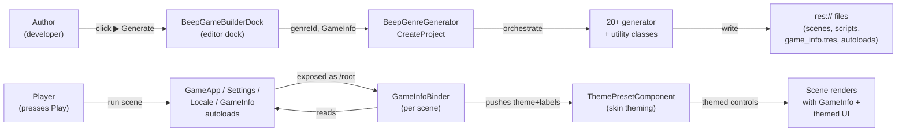
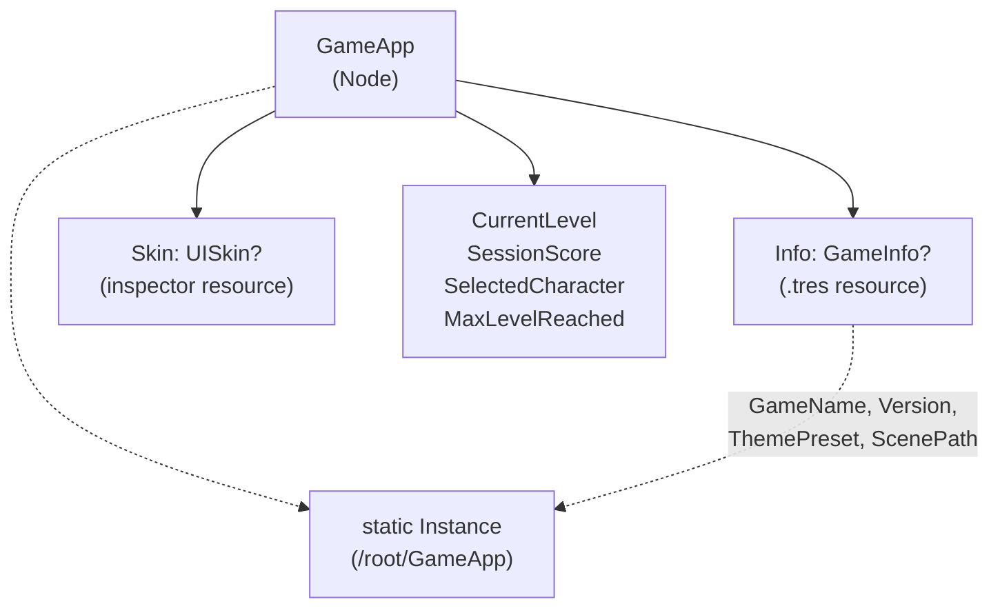

# App Workflow — How a Game Gets Built and Runs

> The C# app layer: from clicking "Generate Project" in the editor dock, through the generators, to autoloads running at runtime. Cross-addon scope — covers only the C# `beep_game_builder_cs` pipeline. Skin details live in [SKINNING_THEMING.md](SKINNING_THEMING.md).

---

## 1. End-to-end app lifecycle



The five stages in detail:

| Stage | Where | Class | Output |
|-------|-------|-------|--------|
| 1. Author intent | Editor | user input | picks genre + theme + palette + game name in dock |
| 2. Generate | Editor | `BeepGenreGenerator.CreateProject` | writes `game_info.tres` + scenes + autoloads |
| 3. Build C# | Editor | `dotnet build` / `Build → Build Project` | produces `Beep.Godot.dll` |
| 4. Run scene | Runtime | SceneTree loads MainMenu scene | GameApp autoload boots |
| 5. Per-scene wire | Runtime | `GameInfoBinder._Ready()` | labels + theme applied to UI |

---

## 2. The editor dock

**File:** `addons/beep_game_builder_cs/ui/BeepGameBuilderDock.cs`
**Partial:** `addons/beep_game_builder_cs/ui/BeepGameBuilderDock.Genres.cs`

The dock is a `VBoxContainer` containing a `TabContainer` plus a checkbox and output log. Hosted by `BeepGameBuilderPlugin` (the `EditorPlugin` for the C# addon) via:

```csharp
public override void _EnterTree()
{
    _dock = new BeepGameBuilderDock { EditorPlugin = this };
    AddControlToDock(DockSlot.RightUl, _dock);
    TryEnableMcpBridge();
    GD.Print("[Beep Game Builder] Plugin enabled.");
}
```

### Current tab order (11 tabs — see `plans/app-genre-tab-redesign.md` for refactor)

| # | Tab | Builder method | What it does |
|---|-----|----------------|---------------|
| 1 | Project | `AddProjectTab` | Generate folders / defaults / input map / managers / starter project |
| 2 | Scenes | `AddScenesTab` | Generate main scene / menus / template scenes |
| 3 | Characters | `AddCharactersTab` | Generate player / NPC / enemy scripts and scenes |
| 4 | Shaders | `AddShadersTab` | Pick shader presets from `shader_presets.json` → write `.gdshader` |
| 5 | Tweens | `AddTweensTab` | Pick from `tween_presets.json` → aggregated `tween_effects.gd` |
| 6 | Particles | `AddParticlesTab` | Pick from `particle_presets.json` → particle scenes + helper |
| 7 | Projectiles | `AddProjectilesTab` | Generate projectile math / 2D scripts + scenes |
| 8 | ECS Components | `AddComponentsTab` | Read-only list of 51+ components (categorized for browsing) |
| 9 | Validation | `AddValidationTab` | Run `BeepValidator.Validate` / `FixSafeIssues` / `WriteReport` |
| 10 | Export | `AddExportTab` | Generate + open `EXPORT_CHECKLIST.md` |
| 11 | Genres | `AddGenresTab` (partial) | Genre-themed starter projects (per-genre sections — currently duplicated; refactor pending) |

### Common helpers

```csharp
private ScrollContainer MakeTab(TabContainer tabs, string title);          // wraps content in Scroll + VBox
private static VBoxContainer GetBox(ScrollContainer s);                  // returns the inner VBox
private static Button AddButton(Node parent, string text, Action action);
private static Label AddLabel(Node parent, string text);
private static LineEdit AddSearch(Node parent, string placeholder);
private void Log(string msg);                                              // appends to _output TextEdit
```

The Log hook is wired to `BeepFileUtils.LogCallback` / `ErrorCallback` (line 22-23), so every other generator that calls `BeepFileUtils.Log(...)` writes into the dock's output panel.

---

## 3. The single entry point: `BeepGenreGenerator`

**File:** `addons/beep_game_builder_cs/core/BeepGenreGenerator.cs`
**Namespace:** `Beep.GameBuilder` · **All-static** · **213 lines**

```csharp
public static List<string> CreateProject(string genreId, GameInfo info, bool overwrite = false)
```

This is the **only** method the dock should call. It is fully data-driven: it reads the genre folder's `genre.json` to know the theme list, scene list, main scene, and tuning — zero hardcoded genre data.

### Internal pipeline (the heart of the addon)

```
StampProject(info, genre, overwrite)         // returns log lines
│
├─ [1] BeepProjectGenerator.CreateStandardFolders()
│       Writes 20 folders under res:// (scenes/*, scripts/*, assets/*, resources/*, autoload)
│
├─ [2] BeepInputMapGenerator.SetupDefaultInput()
│       Idempotently registers move_up/down/left/right, jump, attack, interact, dash, pause,
│       ui_accept, ui_cancel — keyboard + mouse + gamepad
│
├─ [3] EnsureAutoload × 4
│       GameApp → res://addons/beep_game_builder_cs/ecs/GameApp.cs
│       Settings → res://addons/beep_game_builder_cs/ecs/ui/SettingsComponent.cs
│       Locale → res://addons/beep_game_builder_cs/ecs/ui/LocalizationComponent.cs
│       GameInfo → res://game_info.tres (the resource file)
│       (uses BeepProjectDefaults.AddAutoload under the hood)
│
├─ [4] WriteGameInfoTres(info)
│       ResourceSaver.Save(info, "res://game_info.tres")
│
├─ [5] StampTranslations(overwrite)
│       Copies templates/i18n/translations.csv → res://i18n/translations.csv
│       Sets internationalization/locale/translations = true
│
├─ [6] CopyUiScene × 5 (shared UI)
│       main_menu.tscn, pause_menu.tscn, settings_menu.tscn, game_over.tscn, hud.tscn
│       Source: res://addons/beep_game_builder_cs/templates/scenes/
│       Dest:   res://scenes/ui/
│
├─ [7] CopyGenreUiScenes(genre)
│       Iterates genre.Scenes[] from genre.json
│       Source: res://addons/beep_game_builder_cs/templates/scenes/<genre>/<scene>
│       Dest:   res://scenes/ui/<genre>/<scene>
│
├─ [8] CopyGenreScene(genre, info.GameScenePath)
│       Uses genre.MainScene from genre.json (or `<genre>_main.tscn` fallback)
│       Dest: res://scenes/main/<genre.MainScene>
│
└─ [9] BeepProjectDefaults.ApplyFromGameInfo(info)
        Sets window size, FPS, stretch, pixel-art filter, main scene, application name/version
```

### Tuning merge

`ApplyTuning(info, genre)` reads `genre.json`'s `tuning{}` block and writes into the `GameInfo` before save:

| key | GameInfo field | Used by |
|-----|----------------|---------|
| `gravity` | `info.Gravity` (float) | PlatformerController |
| `jump_velocity` | `info.JumpVelocity` | PlatformerController |
| `move_speed` | `info.MoveSpeed` | TopDown + Platformer + Shooter |
| `fire_rate` | `info.FireRate` | Shooter |
| `grid_width` / `grid_height` | `info.GridWidth/Height` | Puzzle |
| `target_score` | `info.TargetScore` | Puzzle |

Genre-specific overrides win: `puzzle/genre.json` ships `{grid_width: 8, grid_height: 8, target_score: 1000}` so a new puzzle project opens with the right defaults without the user touching `GameInfo`.

---

## 4. The individual generators

All in `addons/beep_game_builder_cs/core/`, all-static. They are **standalone** when called individually but typically run inside `BeepGenreGenerator.StampProject`.

| Generator | Reads | Writes | Standalone? |
|-----------|-------|--------|------------|
| `BeepProjectGenerator` | nothing | 20 folders | yes |
| `BeepInputMapGenerator` | InputMap state | InputMap + ProjectSettings | yes (idempotent) |
| `BeepScriptGenerator.CreateTopDownPlayer/PlatformerPlayer/RobotNpc/CameraFollow/SceneManager/SaveManager/AudioManager` | nothing | inline `.gd` strings → `scripts/` | yes (forced-overwrite) |
| `BeepScriptGenerator.CreateEnemyPatrol/HealthComponent/PickupItem/...` | `templates/scripts/*.gd.template` | copies → `scripts/` | yes (template files must exist) |
| `BeepSceneGenerator.CreateMainScene/MainMenu/PauseMenu` | nothing | `.tscn` at literal paths | yes |
| `BeepSceneGenerator.CreateTopDownPlayerScene/PlatformerPlayerScene/RobotNpcScene` | `scriptPath` (must exist) | `.tscn` + attached script | depends on scripts first |
| `BeepSceneGenerator.CreateTemplateScene` | `templates/scenes/<name>.tscn` | copies to target | yes |
| `BeepShaderGenerator` | `shader_presets.json` + `templates/shaders/*.gdshader.template` | `assets/shaders/<id>.gdshader` | yes |
| `BeepTweenGenerator` | `tween_presets.json` | aggregated `scripts/effects/tween_effects.gd` | yes |
| `BeepParticleGenerator` | `particle_presets.json` + `templates/scenes/particles/*` | particle scenes + helper | yes |
| `BeepProjectileGenerator` | nothing | `scripts/projectile_math.gd`, `projectile_2d.gd`, basic/arc scenes | yes |
| `BeepProjectDefaults` | GameInfo (when `ApplyFromGameInfo`) | ProjectSettings keys | yes |
| `BeepExportChecklist` | nothing | `EXPORT_CHECKLIST.md` | yes |
| `BeepValidator` | res:// filesystem | log lines (or markdown via `WriteReport`) | yes |

### `OnStarter` — the legacy parallel pipeline

The dock's "Generate Starter Project (All)" button (`BeepGameBuilderDock.cs:307`) does NOT call `BeepGenreGenerator.CreateProject`. It hand-codes a fixed array of shaders (`day_night_tint`, `player_recolor`, `outline_2d`, `damage_flash`, `dissolve`), particles, projectiles, and bypasses the genre system entirely. This is **legacy code** that should be replaced with `BeepGenreGenerator.CreateProject("platformer", new GameInfo { ... }, overwrite)` in a future cleanup — see `plans/app-genre-tab-redesign.md` Phase 1.

---

## 5. The autoload quartet

Registered by `BeepGenreGenerator.StampProject` only when a project is first stamped. None exist in the dev project by default.

### `GameApp` — the runtime singleton

**File:** `addons/beep_game_builder_cs/ecs/GameApp.cs`
**Namespace:** `Beep.ECS` · `[Tool] [GlobalClass] partial class GameApp : Node` · **116 lines**



| Member | Type | Default | Lifetime | Notes |
|--------|------|---------|----------|-------|
| `Info` | `GameInfo?` | loaded from `res://game_info.tres` in `_Ready` if not inspector-assigned | edit-time + runtime | static config — edited in `.tres`, rarely changes at runtime |
| `Skin` | `UISkin?` | null | edit-time + runtime | optional texture skin pushed by `GameInfoBinder` |
| `CurrentLevel` | int | -1 | runtime | "not in a level" |
| `SessionScore` | int | 0 | runtime | emitted via `SessionScoreChanged` signal |
| `SelectedCharacter` | string | "" | runtime | for shooter / rpg |
| `MaxLevelReached` | int | 0 | runtime | for unlocks |
| `static Instance` | GameApp? | lazy-resolves `/root/GameApp` | singleton | works in editor + runtime |

**Static convenience accessors** (so callers can do `GameApp.Instance.GameName`):
- `GameName` → `Info?.GameName ?? "My Game"`
- `Version` → `Info?.Version ?? "0.1.0"`
- `ThemePreset` → `Info?.DefaultThemePreset ?? "Modern"`
- `GameScenePath`, `MainMenuPath`, etc.

**Runtime mutators** (emit signals so UI can react):
- `AddSessionScore(int)` → `SessionScoreChanged`
- `SetLevel(int)` → `LevelChanged`
- `ResetSession()` → both signals

**`Instance` resolution** (the lazy singleton):
```csharp
public static GameApp? Instance
{
    get
    {
        if (_instance != null && GodotObject.IsInstanceValid(_instance)) return _instance;
        if (Engine.GetMainLoop() is SceneTree tree
            && tree.Root.GetNodeOrNull<GameApp>("/root/GameApp") is { } ga)
        {
            _instance = ga;
            return ga;
        }
        return null;
    }
}
```

`_EnterTree` caches the singleton IF the GameApp was added directly to the SceneTree root (the autoload pattern).

### `Settings`, `Locale`

- `Settings` → `Beep.ECS.UI.SettingsComponent` (autoload). User audio/display/language settings.
- `Locale` → `Beep.ECS.UI.LocalizationComponent` (autoload). Loads `res://i18n/translations.csv` per `project.godot`'s `internationalization/locale/translations` setting.

### `GameInfo` — the resource

**File:** `addons/beep_game_builder_cs/core/GameInfo.cs`
**Namespace:** `Beep.GameBuilder` · `[Tool] [GlobalClass] partial class GameInfo : Resource` · **110 lines**

Static config that saves as a `.tres`. Every `[Export]` is editable in the inspector AND consumed at runtime via `GameApp.Instance.Info`.

| Group | Fields | Type | Default |
|-------|--------|------|---------|
| Identity | `GameName` | string | `"My Game"` |
| | `Version` | string | `"0.1.0"` |
| | `Developer` | string | `""` |
| | `Genre` | `GameGenre` enum | `Platformer` |
| | `Description` | string | `""` |
| Display | `TargetResolutionWidth` | int | `1280` |
| | `TargetResolutionHeight` | int | `720` |
| | `PixelArt` | bool | `true` |
| | `TargetFps` | int | `60` |
| Theme | `DefaultThemePreset` | string | `"modern"` |
| | `PaletteName` | string | `"Default"` |
| | `GeometryProfileName` | string | `"As-Authored"` |
| Scene paths | `MainMenuPath` | string | `"res://scenes/ui/main_menu.tscn"` |
| | `GameScenePath` | string | `"res://scenes/main/main.tscn"` |
| | `SettingsScenePath` | string | `"res://scenes/ui/settings_menu.tscn"` |
| | `GameOverScenePath` | string | `"res://scenes/ui/game_over.tscn"` |
| Platformer | `Gravity` | float | `980` |
| | `JumpVelocity` | float | `-400` |
| Movement | `MoveSpeed` | float | `200` |
| Shooter | `FireRate` | float | `0.2` |
| Puzzle | `GridWidth` | int | `8` |
| | `GridHeight` | int | `8` |
| | `TargetScore` | int | `1000` |

**Static helpers:**
- `const string TresPath = "res://game_info.tres";` — the canonical location.
- `static GameInfo? Instance` — lazy-resolves `/root/GameInfo` (the autoload slot).
- `static string RecommendedTheme(GameGenre genre)` — `SkinCatalog.GetGenre(...).DefaultTheme`.
- `static string[] RecommendedThemes(GameGenre genre)` — all theme ids for a genre.
- `static GameGenre GenreFromId(string genreId)` — Pascal-cases the id then `Enum.TryParse`.

`GenreFromId` is the inverse of `enum.ToString().ToLowerInvariant()`. The bridge between file-system strings and C# enum.

---

## 6. The scene-side bridge: `GameInfoBinder`

**File:** `addons/beep_game_builder_cs/ecs/ui/GameInfoBinder.cs`
**Namespace:** `Beep.ECS.UI` · `[Tool] [GlobalClass] partial class GameInfoBinder : EntityComponent` · **83 lines**

A drop-in Node component for any UI scene. Reads `GameInfo.Instance` and pushes values into sibling nodes — so editing `game_info.tres` once updates every menu.

### Exports

```csharp
[Export] public NodePath TitleLabelPath { get; set; }   // → "My Game" or "{existing} — My Game"
[Export] public NodePath VersionLabelPath { get; set; }  // → "v0.1.0"
[Export] public NodePath GenreLabelPath { get; set; }    // → "Platformer" etc.
[Export] public NodePath ThemeComponentPath { get; set; } // → sibling ThemePresetComponent
[Export] public bool SetWindowTitle { get; set; }         // → OS window title = game name
[Export] public bool AppendGameName { get; set; }         // → title prefix mode
```

### Lifecycle

`_Ready()` calls `CallDeferred(nameof(Bind))` so children resolve before reading.

```csharp
public void Bind()
{
    var info = GameBuilder.GameInfo.Instance;
    if (info == null) GD.PushWarning("[GameInfoBinder] No GameInfo autoload — placeholder values.");
    var parent = GetParent();

    // Labels.
    if (!TitleLabelPath.IsEmpty && parent.GetNodeOrNull<Label>(TitleLabelPath) is { } title)
        title.Text = AppendGameName ? $"{title.Text} — {info.GameName}" : info.GameName;
    // ... VersionLabel, GenreLabel similar ...

    // ThemePresetComponent sibling.
    if (!ThemeComponentPath.IsEmpty && parent.GetNodeOrNull<ThemePresetComponent>(ThemeComponentPath) is { } theme)
    {
        theme.GenreName           = info.Genre.ToString().ToLowerInvariant();
        theme.PresetName          = info.DefaultThemePreset.ToLowerInvariant();
        theme.PaletteName         = info.PaletteName;
        theme.GeometryProfileName = info.GeometryProfileName;
        if (GameApp.Instance?.Skin is { } s) theme.Skin = s;  // optional UISkin
    }

    // OS window.
    if (SetWindowTitle && GetTree().Root is Window root)
        root.Title = info.GameName;
}
```

**Scene usage:**
```
[node name="MainMenu" type="Control"]
[node name="GameInfoBinder" type="Node" parent="."]
script = GameInfoBinder
title_label_path = NodePath("Center/MenuVBox/TitleLabel")
version_label_path = NodePath("Center/MenuVBox/VersionLabel")
theme_component_path = NodePath("Theme")
```

---

## 7. Runtime: what runs when you press Play

```
Godot loads project.godot
    │
    ├─ [Autoload] GameInfo → ResourceLoader.Load<GameInfo>("res://game_info.tres")  ← IF registered
    ├─ [Autoload] GameApp  → _EnterTree → Instance cached, _Ready → load Info from tres
    ├─ [Autoload] Settings → SettingsComponent._Ready
    └─ [Autoload] Locale  → LocalizationComponent._Ready → load translations.csv
    │
    └─ Main scene loads (set by BeepProjectDefaults.ApplyFromGameInfo → info.MainMenuPath)
        │
        ├─ GameInfoBinder._Ready → CallDeferred(Bind)
        │       ↓ deferred
        │   Bind() → push GameName into TitleLabel, push genre/theme into ThemePresetComponent
        │       ↓ triggers
        │   ThemePresetComponent._Ready → ApplyTheme() → SkinCatalog → FileThemePreset → Theme built → subtree styled
        │
        ├─ Buttons respond to hover/press tween injections
        │
        └─ Scene renders themed UI, ready for input
```

If `GameApp` is **not registered** (e.g., opening the dev project without running a generator), `GameApp.Instance` returns null and `GameInfoBinder` pushes a warning. The dock + SkinCatalog still work in editor — only runtime scenes need the autoloads.

---

## 8. The MCP bridge (AI agent surface)

**Files:** `addons/beep_game_builder_cs/mcp/*.cs`
**Wire:** `ws://127.0.0.1:8789`

`BeepGameBuilderPlugin._EnterTree` calls `TryEnableMcpBridge` which:
1. Calls `GodotMcpSettings.EnsureProjectSettings` (writes project.godot settings).
2. Registers two autoloads: `McpGameAdapter` (game-side, provides scene-tree introspection to the agent) and `GodotMcpRuntime` (the runtime-side of the WebSocket).
3. Constructs `GodotMcpBridgeController`, configures it as the `editor` role, connects.

`_ExitTree` symmetrically tears down: `DisconnectBridge`, `QueueFree`, `RemoveAutoload` × 2, `ProjectSettings.Save`.

`GodotMcpSettings.GetUrl()` / `GetToken()` read from `project.godot`'s `mcp/` settings section. The token in the dev `project.godot` is hardcoded (`c9646ef74b0d4f7ea9b6396916b28cdc`) and not safe for production.

---

## 9. Default paths & values (reference)

All paths `res://`-rooted. All write methods go through `BeepFileUtils.SafeWriteText`, which refuses to overwrite unless `overwrite=true`.

| Concept | Default | Source |
|---------|---------|--------|
| Project name | `Beep.Godot` | `project.godot` |
| Plugin config versions | `Beep Game Builder 0.4.0`, `Beep UI 0.2.0` | `plugin.cfg` × 2 |
| Resolution | 1280 × 720 | `GameInfo.TargetResolution*` + `BeepProjectDefaults.ConfigureDefaults` |
| Stretch mode | `canvas_items` keep | same |
| Pixel-art filter | off | `GameInfo.PixelArt` defaults true → `ApplyFromGameInfo` sets filter=0 |
| Target FPS | 60 | `GameInfo.TargetFps` |
| Main menu | `res://scenes/ui/main_menu.tscn` | `GameInfo.MainMenuPath` |
| Game scene | `res://scenes/main/main.tscn` (or genre-specific) | `GameInfo.GameScenePath` |
| Default theme | `"modern"` | `GameInfo.DefaultThemePreset`, overridable by `genre.json`'s `default_theme` |
| Default palette | `"Default"` | `GameInfo.PaletteName` |
| Default geometry profile | `"As-Authored"` | `GameInfo.GeometryProfileName` |
| Platformer gravity / jump | 980 / -400 | `GameInfo` overrides by `genre.json tuning` |
| Shooter fire rate | 0.2 | same |
| Puzzle grid | 8 × 8 | same |
| MCP bridge URL | `ws://127.0.0.1:8789` | `GodotMcpSettings.GetUrl` |
| Skin root | `res://addons/beep_game_builder_cs/catalogs/skins/` | `SkinCatalog.SkinsRoot` const |
| GameInfo file | `res://game_info.tres` | `GameInfo.TresPath` const |
| i18n | `res://i18n/translations.csv` | `BeepGenreGenerator.I18nTargetPath` const |

---

## 10. Known gotchas

1. **The dev project has no autoloads** — the dock + `SkinCatalog` work without them; runtime scenes fail until you stamp a project (which registers the 4 autoloads).
2. **`OnStarter` is genre-blind** — it hand-codes shaders/particles/projectiles. Use `BeepGenreGenerator.CreateProject` instead.
3. **`BeepGenreGenerator.CreateProject` mutates `info`** — sets `Genre`, `DefaultThemePreset`, `GameScenePath`, and tuning from `genre.json`. Pass a fresh `GameInfo` instance per call.
4. **Genre default theme overrides user choice** — only when `info.DefaultThemePreset` is empty or `"Modern"`. Always pass the genre's actual default if you want non-genre default behavior.
5. **BeepScriptGenerator inline writes are forced-overwrite** — every dock click replaces. Template copies honor `BeepFileUtils.SafeWriteText`'s `overwrite=false` default.
6. **The dock's `Log` callback is wired on `_Ready`** — before that, generators that call `BeepFileUtils.Log(...)` print to stdout only. Re-entering the dock resets the output panel.
7. **`GameApp.Skin` is `[Export]` on the autoload** — but the autoload node is auto-spawned, so authors usually edit `GameInfoBinder` or set it programmatically. The dock's `App` tab (planned) will surface this.
8. **`genre.json`'s `scenes[]` are filenames only** — `BeepGenreGenerator` joins them to `templates/scenes/<genre>/<scene>` (source) and `res://scenes/ui/<genre>/<scene>` (dest). Mismatched filenames = skipped files.

---

## 11. Read next

- **[SKINNING_THEMING.md](SKINNING_THEMING.md)** — the cross-addon skin pipeline (`SkinCatalog` ↔ `ThemePresetComponent` ↔ `BeepThemeApplier`)
- **[ARCHITECTURE.md](ARCHITECTURE.md)** — back to the master map