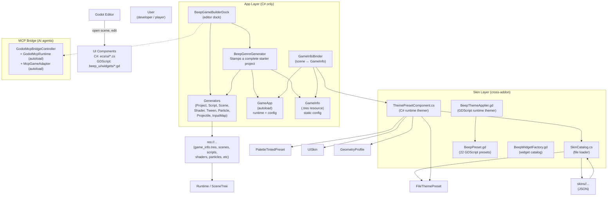
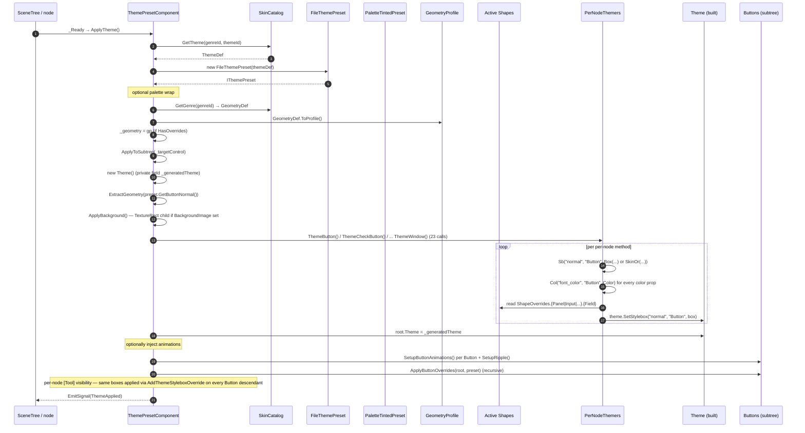

# Beep.Godot — Master Architecture

> Cross-cutting map of **both addons** in this repo: `beep_game_builder_cs` (C#) and `beep_ui` (GDScript). This is the **hub doc**. Domain-specific details live in:
> - **[APP_WORKFLOW.md](APP_WORKFLOW.md)** — project generation, generators, autoloads, scene wiring
> - **[SKINNING_THEMING.md](SKINNING_THEMING.md)** — visual preset/geometry/texture/background pipeline
> - **[FILE_FORMATS.md](FILE_FORMATS.md)** — JSON schema reference for skin catalogs

---

## 1. The two-addon shape

| Addon | Language | Purpose | Can run alone? |
|-------|----------|---------|----------------|
| **`beep_game_builder_cs`** | C# (.NET 8) | Project scaffolding (project/scene/script/shader/tween/particle/projectile generators), **skin catalog loader** (`SkinCatalog`), `GameApp` autoload, 50+ ECS components, MCP bridge for AI agents | **Partially** — the components and SkinCatalog work without `beep_ui`; the `BeepThemeApplier` workflow runs without it |
| **`beep_ui`** | GDScript | Theming engine (22 presets, 11 effects, 84+ drag-and-drop widget prefabs), the `theme_studio.gd` editor dock | **Yes** — fully self-contained; runs in any Godot 4.3+ project, pure-GDScript ones included |

The two addons **share zero source files** but are designed to coexist: a project can enable both, and C# scenes can use the GDScript theming (the C# addon has its own equivalent that reads the same JSON catalog).

---

## 2. Directory layout

```
Beep.Godot/                                    ← this repo (dev/build harness for both addons)
├── project.godot                              ← editor config; enables both plugins
├── Beep.Godot.csproj / .sln                   ← C# build
├── addons/
│   ├── beep_game_builder_cs/                  ← C# addon
│   │   ├── plugin.cfg
│   │   ├── BeepGameBuilderPlugin.cs           ← EditorPlugin: dock + MCP bridge
│   │   ├── core/                              ← generators + utilities (16 .cs files)
│   │   │   ├── BeepGenreGenerator.cs          ← project stamper (THE entry point)
│   │   │   ├── BeepSceneGenerator.cs          ← bare scene files
│   │   │   ├── BeepProjectGenerator.cs        ← folder scaffolding
│   │   │   ├── BeepScriptGenerator.cs         ← inline + template .gd files
│   │   │   ├── BeepShaderGenerator.cs         ← .gdshader from shader_presets.json
│   │   │   ├── BeepTweenGenerator.cs          ← aggregated tween helper
│   │   │   ├── BeepParticleGenerator.cs       ← .tscn particle scenes
│   │   │   ├── BeepProjectileGenerator.cs     ← basic/arc projectile scenes
│   │   │   ├── BeepInputMapGenerator.cs       ← idempotent input actions
│   │   │   ├── BeepProjectDefaults.cs         ← ProjectSettings writes
│   │   │   ├── BeepValidator.cs               ← project integrity check
│   │   │   ├── BeepExportChecklist.cs         ← EXPORT_CHECKLIST.md
│   │   │   ├── BeepFileUtils.cs               ← all file I/O + log callbacks
│   │   │   ├── BeepKeybindManager.cs          ← runtime key registry
│   │   │   ├── BeepServiceLocator.cs          ← DI helper
│   │   │   ├── BeepStateMachine.cs            ← generic FSM
│   │   │   ├── BeepProceduralAnim.cs          ← noise helpers
│   │   │   ├── GameInfo.cs                    ← [GlobalClass] Resource: config
│   │   │   ├── BeepEncryptionPathfinding.cs
│   │   │   ├── BeepDataBinder.cs
│   │   │   ├── BeepFormBuilder.cs
│   │   │   ├── BeepDataGrid.cs
│   │   │   ├── BeepAchievementDebug.cs
│   │   │   ├── BeepTreeView.cs
│   │   │   ├── BeepDropdown.cs
│   │   ├── ecs/                               ← runtime nodes + ECS
│   │   │   ├── GameApp.cs                     ← THE runtime autoload
│   │   │   ├── EntityComponent.cs             ← base class for ~60 components
│   │   │   ├── EntitySystem.cs                ← base class for system runners
│   │   │   ├── + 47 *.cs components (Player, Enemy, AI, Camera, Particles, etc)
│   │   ├── ecs/ui/                            ← UI components (~60 .cs files)
│   │   │   ├── ThemePresetComponent.cs        ← C# theming entry (the `IThemePreset` runtime)
│   │   │   ├── ThemePresetComponent.NodeTheming.cs  ← per-node-type theming methods
│   │   │   ├── SkinCatalog.cs                 ← file-based JSON loader (THE skin entry)
│   │   │   ├── FileThemePreset.cs              ← wraps ThemeDef as IThemePreset
│   │   │   ├── PaletteTintedPreset.cs          ← decorator
│   │   │   ├── ShapeOverrides.cs              ← per-node-type shape knobs
│   │   │   ├── UISkin.cs                      ← [GlobalClass] Resource: textures
│   │   │   ├── GeometryProfile.cs             ← [GlobalClass] Resource: geometry profile
│   │   │   ├── ColorPalette.cs                ← [GlobalClass] Resource: palette
│   │   │   ├── IThemePreset.cs                ← the contract
│   │   │   ├── GameInfoBinder.cs              ← scene ←→ GameInfo bridge
│   │   │   ├── + ~50 *.cs components (Accordion, Toast, Ripple, Toggle, etc)
│   │   ├── ui/                               ← editor dock only
│   │   │   ├── BeepGameBuilderDock.cs         ← editor dock VBoxContainer
│   │   │   ├── BeepGameBuilderDock.Genres.cs  ← genre-tab partial
│   │   ├── mcp/                              ← MCP bridge (AI agents)
│   │   │   ├── GodotMcpBridgeController.cs
│   │   │   ├── GodotMcpRuntime.cs             ← runtime side, registered as autoload
│   │   │   ├── GodotMcpSettings.cs
│   │   │   ├── McpGameAdapter.cs              ← game-side autoload
│   │   ├── catalogs/                          ← INPUT: JSON that drives everything
│   │   │   ├── shader_presets.json
│   │   │   ├── tween_presets.json
│   │   │   ├── particle_presets.json
│   │   │   ├── projectile_presets.json
│   │   │   └── skins/                         ← THE skin catalog tree
│   │   │       ├── platformer/{genre.json, geometry.json, themes/{5 themes}/}
│   │   │       ├── topdown/   {genre.json, geometry.json, themes/{5 themes}/}
│   │   │       ├── shooter/   {genre.json, geometry.json, themes/{5 themes}/}
│   │   │       └── puzzle/    {genre.json, geometry.json, themes/{5 themes}/}
│   │   ├── templates/                         ← scene/script/i18n templates
│   │   │   ├── scenes/{main_menu, pause_menu, settings_menu, game_over, hud}.tscn
│   │   │   ├── scenes/<genre>/                ← genre-specific scene templates
│   │   │   ├── scripts/*.gd.template
│   │   │   └── i18n/translations.csv
│   │   └── generated/                         ← OUTPUT (if the user runs generators)
│   │       └── (filled by BeepGenreGenerator when run)
│   └── beep_ui/                               ← GDScript addon
│       ├── plugin.cfg
│       ├── plugin.gd                          ← EditorPlugin: Theme Studio dock
│       ├── editor/
│       │   └── theme_studio.gd                ← 2-tab dock: Themes + Widgets
│       ├── theme/
│       │   ├── beep_theme.gd                  ← BeepPreset (ColorSchema + AnimationConfig + Geometry)
│       │   ├── theme_applier.gd               ← BeepThemeApplier (the runtime themer)
│       │   └── preset_*.gd                    ← 22 preset_*.gd scripts (Cartoon, Modern, ...)
│       ├── effects/
│       │   └── ui_effect.gd                   ← BeepUIEffect (11 effects × 4 scopes)
│       └── widgets/
│           ├── widget_factory.gd              ← BeepWidgetFactory (84 catalog entries)
│           └── toast_host.gd                  ← BeepToastHost
└── docs/                                      ← this documentation
    ├── ARCHITECTURE.md                        ← you are here
    ├── APP_WORKFLOW.md                        ← App layer deep-dive
    ├── SKINNING_THEMING.md                    ← Skin layer deep-dive
    └── FILE_FORMATS.md                         ← JSON schema reference
```

---

## 3. Layer diagram



---

## 4. Top-level data flow

There are **three pipelines** in this repo, all driven by the editor dock:

### Pipeline A — "Build a project from scratch"
```
User clicks "▶ Generate Project" in dock (or "App" tab's genre form)
    ↓
BeepGameBuilderDock.AddGenresTab → BeepGameBuilderDock.Genres.cs (or App-tab plan equivalent)
    ↓
BeepGenreGenerator.CreateProject(genreId, gameInfo, overwrite)
    ↓
[1] folders         via BeepProjectGenerator.CreateStandardFolders
[2] input map       via BeepInputMapGenerator.SetupDefaultInput
[3] autoloads       via BeepProjectDefaults.AddAutoload (GameApp, Settings, Locale, GameInfo)
[4] GameInfo.tres   via ResourceSaver.Save(info, "res://game_info.tres")
[5] translations    copies templates/i18n/translations.csv
[6] shared UI scenes copies 5 .tscn templates to res://scenes/ui/
[7] genre UI scenes copies genre.json scenes[] entries to res://scenes/ui/<genre>/
[8] main gameplay   copies genre.MainScene to res://scenes/main/
[9] project settings via BeepProjectDefaults.ApplyFromGameInfo
    ↓
Result: a playable, themed game for the chosen genre
```

### Pipeline B — "Apply a theme to a UI scene at edit-time or runtime"
```
[Edit-time] User picks preset in Theme Studio dock's "Themes" tab
    ↓
BeepPreset.get_preset(name)   ← beep_theme.gd's static registry
    ↓
BeepThemeApplier (parent or child of Control) resolves target
    ↓
_build_theme(p)   ← per-state StyleBoxes (6 button states, 14 colors, 14 node-type panels)
    ↓
ctrl.theme = new_theme   +   per-node AddThemeStyleboxOverride for [Tool] visibility
    ↓
Button hover/press/focus tweens inject if enable_animations && !editor

[Runtime] ThemePresetComponent.cs
    ↓
SkinCatalog.GetTheme(genreId, themeId) + GetGenre + GetGeometry
    ↓
new FileThemePreset(themeDef)  →  optional PaletteTintedPreset wrapper
    ↓
ApplyToSubtree(root)
    ├─ ExtractGeometry(preset.GetButtonNormal())   ← seeds _gTL/_bL/_padL/...
    ├─ ApplyBackground()                            ← spawns TextureRect behind root
    ├─ ThemeButton() / ThemeCheckButton() / ...     ← 23 per-node themers
    │   └─ SkinOr(jsonTex, skinPath, procedural)   ← JSON-wins-per-slot, then UISkin, then procedural
    ├─ root.Theme = _generatedTheme
    ├─ InjectIntoButtons(root)                       ← hover/press tweens + ripple
    └─ ApplyButtonOverrides(root, preset)            ← per-node for [Tool] visibility
```

### Pipeline C — "AI agent drives the editor"
```
External AI agent
    ↓ WebSocket on ws://127.0.0.1:8789
GodotMcpBridgeController (EditorPlugin child)
    ↓ in-editor
Editor + Inspector + Filesystem + Debugger
    ↓
GodotMcpRuntime (autoload, runtime-side, same connection)
McpGameAdapter (autoload, gameplay-side adapter)
    ↓
Tools: run_script, get_scene_tree, set_property, save_scene, ...
```

---

## 5. The four orthogonal dimensions of a skin

Every UI surface in the engine is the **intersection** of four independent dimensions. Each is JSON-driven and has its own resolution order:

| Dimension | Where it lives | Reader | Resolution order |
|-----------|----------------|--------|-------------------|
| **Genre** | `skins/<genre>/genre.json` + `geometry.json` | `SkinCatalog.GetGenre()` / `GetGeometry()` | Genre → its default geometry profile |
| **Theme** (colors + geometry + animation) | `skins/<genre>/themes/<theme>/theme.json` | `SkinCatalog.GetTheme()` → `FileThemePreset` | Theme's own geometry baked into every StyleBox (via `ExtractGeometry` from `GetButtonNormal`) |
| **Palette** (HSV tint) | `skins/<genre>/themes/<theme>/<palette>.json` | `SkinCatalog.GetTheme()` → `ColorPalette` → `PaletteTintedPreset` (decorator wraps `FileThemePreset`) | `PaletteTintedPreset.Colors` overrides `FileThemePreset.Colors`; geometry & textures are NOT retinted |
| **Geometry** (genre-wide overrides) | `skins/<genre>/geometry.json` | `SkinCatalog.GetGeometry()` → `GeometryDef.ToProfile()` → `GeometryProfile.ApplyTo()` | Genre geometry stamps every `NewBox()`-derived StyleBox via `StampGeometry` |
| **Texture** (per-slot 9-patch PNGs) | `theme.json`'s `textures{}` block OR inspector `UISkin` resource | `FileThemePreset.Get*Texture()` → `SkinOr(jsonTex, skinPath, procedural)` | JSON wins per-slot → inspector UISkin fills slots the JSON omits → procedural fallback |
| **Shapes** (per-node-type knobs) | `geometry.json`'s `shapes{}` block | `SkinCatalog.ParseShapes` → `GeometryDef.Shapes` → `GeometryProfile.Shapes` → `ThemePresetComponent.ActiveShapes` | `ActiveShapes.Panel.ShadowReduction` etc. consumed by `PanelBox`/`InputBox`/`RoundBox`/`CircleBox`/`SelectedBox` |
| **Background** (canvas image) | `geometry.json`'s `background_image` + `background_mode` | `SkinCatalog.ParseGeometry` → `GeometryDef.BackgroundImage/Mode` → `ThemePresetComponent.ApplyBackground` | Spawns a `TextureRect` as the first child of the themed subtree root, full-rect anchored |

---

## 6. Class/Resource index

### C# namespace layout

| Namespace | Where | Purpose |
|-----------|-------|---------|
| `Beep.GameBuilder` | `core/` | Generators + `GameInfo`. Pure-logic, file-writing utilities. |
| `Beep.ECS` | `ecs/` | Runtime nodes (`GameApp`) and ~47 gameplay components. |
| `Beep.ECS.UI` | `ecs/ui/` | ~60 UI components, `ThemePresetComponent`, `SkinCatalog`, `IThemePreset` family, `[GlobalClass]` resources (`UISkin`, `ColorPalette`, `GeometryProfile`). |
| `Beep.GameBuilder` | `ui/` | The editor dock (`BeepGameBuilderDock` + `BeepGameBuilderDock.Genres` partial). |
| `Beep.GameBuilder` | `mcp/` | MCP bridge classes. |
| `BeepMcp` | `mcp/` | Inner namespace for the bridge controller. |
| `Godot` | (via `using`) | Godot 4.7 SDK. |

### GDScript class_name layout

| `class_name` | File | Lifetime | Purpose |
|--------------|------|----------|---------|
| `BeepPreset` | `addons/beep_ui/theme/beep_theme.gd` | `extends RefCounted` (per-instance, created lazily) | Base class for all 22 presets. Carries ColorSchema + AnimationConfig + GeometryDefaults. |
| `BeepThemeApplier` | `addons/beep_ui/theme/theme_applier.gd` | `extends Node` (attached to widgets / parent of widgets) | Applies a `BeepPreset` to a Control subtree at runtime or edit-time. Port of `ThemePresetComponent.cs` (with the silent-no-op bug fixed). |
| `BeepUIEffect` | `addons/beep_ui/effects/ui_effect.gd` | `extends Node` (attached to any node) | 11 effects × 4 scopes, unified single component. |
| `BeepWidgetFactory` | `addons/beep_ui/widgets/widget_factory.gd` | `extends RefCounted` (static API) | Builds themed widget prefabs on demand. Catalog of 84+ entries. |
| `BeepToastHost` | `addons/beep_ui/widgets/toast_host.gd` | `extends Control` | Standalone toast-notification host widget. |

### C# `[GlobalClass]` resources (savable as `.tres`)

| Class | Default file | Used by |
|-------|--------------|---------|
| `Beep.GameBuilder.GameInfo` | `res://game_info.tres` | `GameApp.Info`, `BeepGenreGenerator`, `GameInfoBinder`, `BeepGameBuilderDock.App` (future) |
| `Beep.ECS.UI.UISkin` | (no default file; assigned per-scene) | `GameApp.Skin`, `ThemePresetComponent.Skin`, `SkinOr()` inspector path |
| `Beep.ECS.UI.ColorPalette` | (no default; built into each `theme.json` directory) | `PaletteTintedPreset`, `ColorPalette.ByName()` |
| `Beep.ECS.UI.GeometryProfile` | (no default; built from each `geometry.json`) | `GeometryProfile.ByName()`, `ThemePresetComponent._geometry` |
| `Beep.ECS.EntityComponent` | n/a (base class) | Base for ~110 `*Component.cs` files |

---

## 7. Autoload registration

Autoloads are NOT registered in `project.godot` by default — `BeepGameBuilderPlugin.cs` only registers the **MCP** ones in this dev project. The four content autoloads (`GameApp` / `Settings` / `Locale` / `GameInfo`) are registered by **`BeepGenreGenerator.StampProject`** when a user generates a starter project for the first time. This keeps the dev/build harness lightweight.

| Autoload | Type | Path | Registered by | When |
|----------|------|------|---------------|------|
| `GameApp` | C# Node | `res://addons/beep_game_builder_cs/ecs/GameApp.cs` | `BeepGenreGenerator.StampProject` | First project stamp |
| `Settings` | C# Component | `res://addons/beep_game_builder_cs/ecs/ui/SettingsComponent.cs` | same | same |
| `Locale` | C# Component | `res://addons/beep_game_builder_cs/ecs/ui/LocalizationComponent.cs` | same | same |
| `GameInfo` | Resource | `res://game_info.tres` (the saved file itself) | same | same |
| `McpGameAdapter` | C# Node | `res://addons/beep_game_builder_cs/mcp/McpGameAdapter.cs` | `BeepGameBuilderPlugin._EnterTree` | Plugin enable |
| `GodotMcpRuntime` | C# Node | `res://addons/beep_game_builder_cs/mcp/GodotMcpRuntime.cs` | same | same |

`BeepGameBuilderPlugin._ExitTree` symmetrically **removes** the MCP autoloads so disabling the plugin leaves no stale `project.godot` entries.

---

## 8. The "ApplyTheme" chain (C# runtime, most important to understand)

`ThemePresetComponent.ApplyTheme()` runs in this order (from the source at `addons/beep_game_builder_cs/ecs/ui/ThemePresetComponent.cs`):



Key invariants:

- **`ApplyTheme()` is idempotent.** Calling it twice produces the same final state.
- **Per-node overrides** at the end (`ApplyButtonOverrides`) are what make the theme visible in the editor **at design time** — without them, the theme only applies at runtime because `theme` cascades are runtime-only.
- **`SetupButtonAnimations`** tracks tweens in `_activeTweens: Dictionary<Button, Tween?>` and kills old tweens on each new event so the button never overlaps two tweens.
- **Textures (per-slot JSON)** win over inspector `UISkin` which wins over procedural `StyleBoxFlat`. This is the order baked into `SkinOr`.

---

## 9. Editor entry points

There are **two editor docks** (one per addon):

| Dock | Plugin | File | Tab order (current) |
|------|--------|------|---------------------|
| `Beep Game Builder (C#)` | `beep_game_builder_cs` | `addons/beep_game_builder_cs/ui/BeepGameBuilderDock.cs` | Project / Scenes / Characters / Shaders / Tweens / Particles / Projectiles / Components / Validation / Export / **Genres** (currently last — see `plans/app-genre-tab-redesign.md` for the planned App-tab-first refactor) |
| `Beep UI` | `beep_ui` | `addons/beep_ui/editor/theme_studio.gd` | Themes / Widgets (only 2 tabs; Genres-tab TBD via the app-tab plan's Phase 4 bridge) |

The MCP bridge auto-enables when both addons are enabled — see `addons/beep_game_builder_cs/BeepGameBuilderPlugin.cs:48-84` (`TryEnableMcpBridge`).

---

## 10. Key relationships at a glance

```
ThemePresetComponent   ──── constructs ────▶  FileThemePreset
                      ──── constructs ────▶  PaletteTintedPreset  (when palette set)
                      ──── reads ──────────▶  SkinCatalog.GetTheme / GetGenre / GetGeometry
                      ──── constructs ────▶  GeometryProfile  (via GeometryDef.ToProfile)
                      ──── reads ──────────▶  ColorPalette.ByName
                      ──── owns ────────────▶  Theme (built per ApplyTheme)
                      ──── applies ─────────▶  Theme on root + AddThemeStyleboxOverride per Button
                      ──── injects ────────▶  Tweens + RippleComponent per Button

FileThemePreset       ──── wraps ───────────▶  ThemeDef (from SkinCatalog.LoadTheme)
                      ──── exposes ─────────▶  ColorSchema + AnimationConfig + Get*Texture()
                      ──── delegates ───────▶  TextureSlotDef.BuildStyleBox()

PaletteTintedPreset    ──── wraps ───────────▶  any IThemePreset
                      ──── tints ───────────▶  ColorSchema + per-box Bg/Border/Shadow
                      ──── pass-through ────▶  Get*Texture() (textures carry own colors)

SkinCatalog            ──── scans ───────────▶  res://addons/beep_game_builder_cs/catalogs/skins/
                      ──── produces ────────▶  GenreDef, ThemeDef, GeometryDef, ThemeTextureSlots,
                                              ColorPalette, ShapeOverrides
                      ──── thread-safe ──────▶  yes (lock on _lock)

GameApp               ──── has ──────────────▶  GameInfo (.tres) + runtime session state
                      ──── exposes ──────────▶  /root/GameApp singleton

GameInfoBinder        ──── reads ────────────▶  GameApp.Instance.Info + GameInfo.Instance
                      ──── pushes ──────────▶  ThemePresetComponent (genre/theme/palette/skin)
                                         +  Labels (title/version/genre)
                                         +  OS window title

BeepGenreGenerator     ──── reads ────────────▶  SkinCatalog.GetGenre (theme list, scene list,
                                                                      main scene, tuning)
                      ──── writes ───────────▶  game_info.tres + i18n + scenes/ui/* + scenes/main/*
                                              + autoloads + ProjectSettings

BeepSceneGenerator     ──── writes ───────────▶  scenes/main/main.tscn, scenes/ui/{main,pause}_menu.tscn
                                               + Player/NPC scenes (depend on scripts)

BeepScriptGenerator    ──── writes ───────────▶  scripts/**/*.gd (inline + templates)

BeepGameBuilderDock    ──── is ────────────────▶  EditorPlugin host for all generator buttons
                      ──── owns ─────────────▶  the Log/Error callbacks (via BeepFileUtils)

BeepPreset (GDScript)  ──── extends ──────────▶  RefCounted (per-preset instance)
                      ──── loaded by ────────▶  theme_studio.gd + theme_applier.gd (lazy .new())

BeepThemeApplier       ──── applied as ──────▶  child OR parent of a Control
                      ──── reads ────────────▶  BeepPreset via BeepPreset.get_preset()
                      ──── builds ──────────▶  Theme + per-Button AddThemeStyleboxOverride
                      ──── injects ──────────▶  hover/press/focus tweens (runtime only)
```

---

## 11. Deployment & distribution

The repo itself is a **buildable dev project**, not the distribution form. To use either addon in a real game:

1. Copy `addons/<name>/` from this repo into your game's `addons/` directory.
2. Open the game in **Godot 4.7 (.NET)** for `beep_game_builder_cs`, or **any Godot 4.3+ project** for `beep_ui`.
3. **Project → Project Settings → Plugins** → enable the addon(s).
4. For `beep_game_builder_cs`: also press **Build → Build Project** so the C# DLL compiles and the `[GlobalClass]` resources are picked up by the editor.

The MCP bridge is part of `beep_game_builder_cs`. It opens a WebSocket on `ws://127.0.0.1:8789` (configurable in `GodotMcpSettings.cs`) and connects to an external AI agent that speaks the MCP protocol.

---

## 12. Read next

- **[APP_WORKFLOW.md](APP_WORKFLOW.md)** — `GameInfo` / `GameApp` / `GameInfoBinder` / `BeepGenreGenerator` / `BeepGameBuilderDock` end-to-end
- **[SKINNING_THEMING.md](SKINNING_THEMING.md)** — `SkinCatalog` / `ThemePresetComponent` / `BeepThemeApplier` / `BeepPreset` / `BeepWidgetFactory` end-to-end
- **[FILE_FORMATS.md](FILE_FORMATS.md)** — exact JSON schema for `genre.json` / `geometry.json` / `theme.json` / palette files