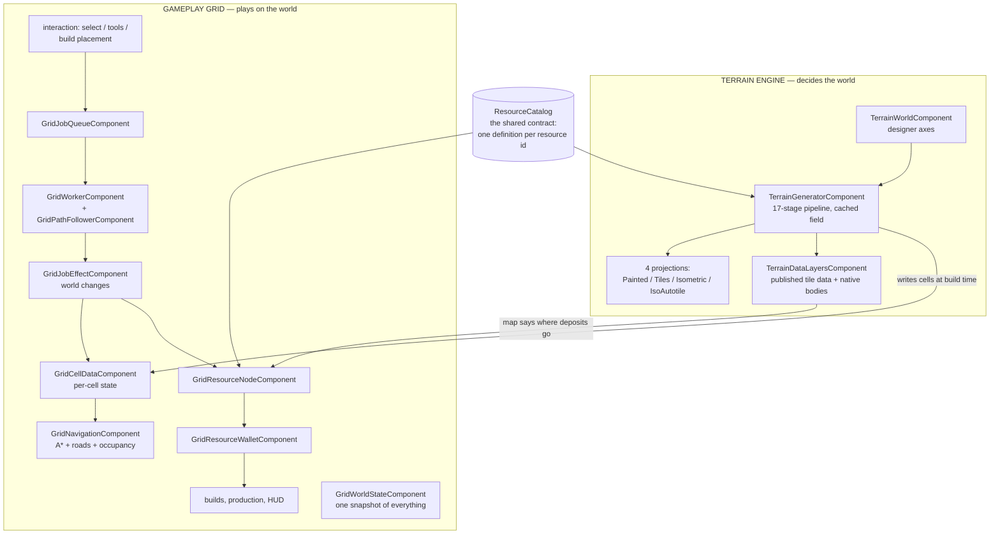

# Engine Overview — Terrain, Grid, Resources

The map of the three systems that began life together in `addons/beep_game_builder_cs/ecs/terrain/` (108 C# files, ~29,500 lines at the time of the full read on 2026-09-02), what each owns, and where they meet. Since the directory split, the terrain engine (`Terrain*`) stays in `ecs/terrain/`, and the grid system (`Grid*`) lives in `ecs/grid/` with its builder panels under `ecs/grid/ui/`.

| System | Prefix | Files | What it is | Guide |
|---|---|---|---|---|
| Terrain engine | `Terrain*` (+ `Mountain*`, `TextureElevation*`) | ~55 | Deterministic world generation (17-stage pipeline), four render projections, published tile data | [terrain-engine/DEVELOPER_GUIDE.md](terrain-engine/DEVELOPER_GUIDE.md) + per-file docs in `terrain-engine/` |
| Gameplay grid | `Grid*` | 51 | The colony-sim toolkit: cells, navigation, placement, jobs, workers, builds, crops, calendar, objectives, interaction, HUD panels | [2D_ISO_TOOLKIT.md](2D_ISO_TOOLKIT.md) |
| Resource system | `Resource*` + `GridResource*` | 8 | The shared catalog bridging map generation and the economy | [resource-system/DEVELOPER_GUIDE.md](resource-system/DEVELOPER_GUIDE.md) |

They shared one directory for historical reasons — all born in one commit (`0763c30`) — split first by *name* (`Terrain*` = engine, `Grid*` = gameplay, the `d4f3208` rename) and now physically: `ecs/terrain/` and `ecs/grid/` (+ `ecs/grid/ui/`); see [ENGINE_ENHANCEMENT_PLAN.md](ENGINE_ENHANCEMENT_PLAN.md).

## How the three systems connect

Three seams carry everything between the systems:

1. **`TerrainGeneratorComponent → GridCellDataComponent`** — at build time the generator writes one terrain kind per cell into the grid model. From then on the grid plays against cells; it never reaches back into generation.
2. **`TerrainDataLayersComponent → GridResourceScatterComponent`** — the published map tells the economy where deposits belong. This path works on a *saved* map with no generator present.
3. **`ResourceCatalog`** — the one definition of every resource id, read by the generation stage, the deposit nodes, the scatter, and the renderers alike.

## Conventions that hold everywhere

- **One owner per fact.** Settings, layer stacks, resource definitions, z-order, passability — each has exactly one deciding class; everything else reads it. Most historical bugs here were second owners drifting.
- **Determinism.** Same seed + same settings = the same world, the same resources, the same prop placement. Randomness is `TerrainGeometry.Hash01(x, y, seed)` per cell, never shared RNG state.
- **Authored-first UI.** HUD components bind authored controls by path or well-known name; runtime generation is an explicit fallback (`GenerateControlsWhenPathsEmpty`).
- **Reference resolution.** Components resolve collaborators from an exported `NodePath`, else a scene-wide search; cached references are re-validated with `GodotObject.IsInstanceValid`.
- **Report, don't silently no-op.** A renderer or system that cannot do its job says so with one named `GD.PushWarning`.
- **Editor authoring is real.** `[Tool]` everywhere, generated nodes adopted to the edited scene root (`TerrainAuthoring`), so generated maps are saved, hand-editable content.

## Verification map

| Layer | Check |
|---|---|
| Static contracts | `tests/addon_contract_scan.ps1` (no Godot needed) |
| Build | `dotnet build Beep.Godot.csproj` |
| Terrain behavior | `tests/terrain_guards.ps1` → `tests/examples/*.gd` (15 checks) |
| Renderer reporting | `tests/renderer_reporting_probe.ps1` |
| Terrain↔grid seams | `tests/grid_terrain_{topology,feature,lake_scatter,transition}_probe.ps1` |
| Grid gameplay | `tests/GridPlacementSmoke.cs` via `tests/runtime_smoke.ps1` |

All Godot-driven checks take `-GodotCommand <path to Godot 4.7 mono>`.
