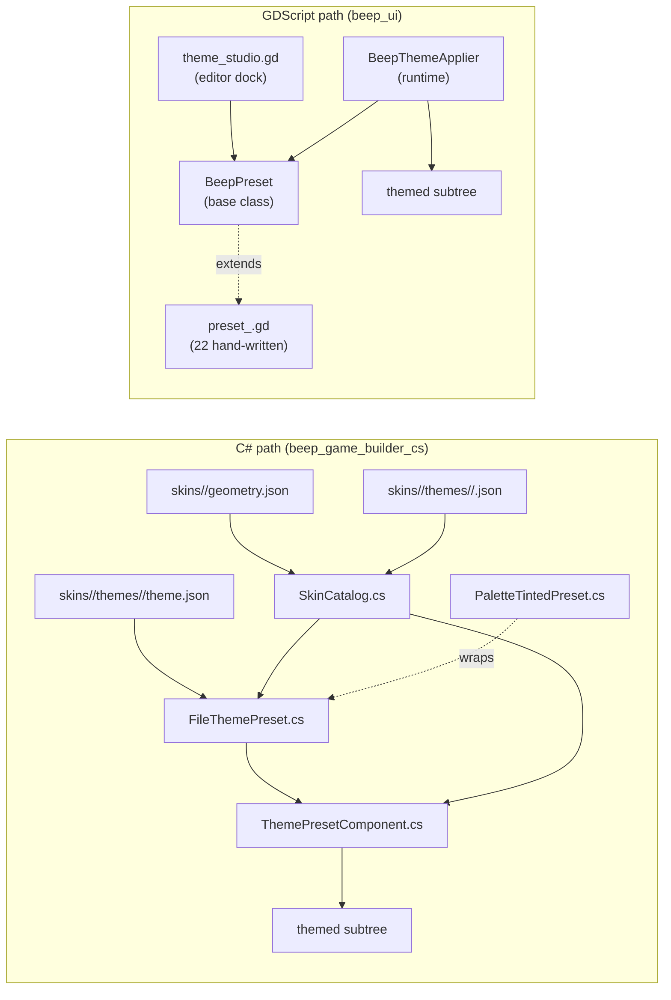
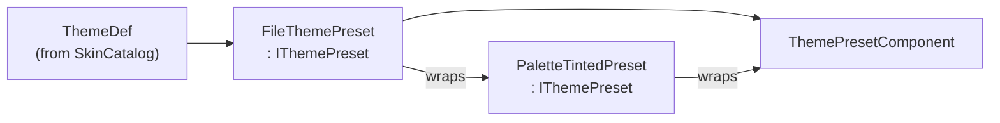

# Skinning & Theming — How a Scene Becomes Pretty

> The cross-addon visual pipeline. Covers BOTH the C# `beep_game_builder_cs` runtime themer (`ThemePresetComponent`) AND the GDScript `beep_ui` dock + applier (`theme_studio.gd`, `BeepThemeApplier`, `BeepPreset`). The two addons share **the same JSON catalog** but produce themes through **two independent code paths** — choose whichever fits your project.

For per-field JSON schemas see **[FILE_FORMATS.md](FILE_FORMATS.md)**. For the master map see **[ARCHITECTURE.md](ARCHITECTURE.md)**.

---

## 1. The four independent skin dimensions

Every UI surface is the intersection of four orthogonal JSON-driven dimensions. Each loads from a different file, each is consumed by a different class.

| Dimension | Lives in | Read by | Override precedence |
|-----------|----------|---------|---------------------|
| **Genre** (e.g. "platformer") | `skins/<genre>/genre.json` + `geometry.json` | `SkinCatalog.GetGenre()` / `GetGeometry()` (C#), `BeepPreset.get_preset()` (GDScript, by name only — see "two addons, two paths" below) | Genre → its default theme |
| **Theme** (colors + per-theme geometry + animation) | `skins/<genre>/themes/<theme>/theme.json` | `SkinCatalog.GetTheme()` → `FileThemePreset` (C#); `beep_ui/theme/preset_<name>.gd` (GDScript, 22 hand-written files) | Theme's own geometry baked into every StyleBox |
| **Palette** (HSV tint) | `skins/<genre>/themes/<theme>/<palette>.json` | `ColorPalette.ByName` (C#); **no GDScript equivalent** | `PaletteTintedPreset` wraps `FileThemePreset`, geometry & textures are NOT retinted |
| **Geometry** (genre-wide overrides) | `skins/<genre>/geometry.json` | `GeometryDef.ToProfile()` → `GeometryProfile.ApplyTo()` (C#); **no GDScript equivalent** | Stamps every `NewBox()`-derived StyleBox via `StampGeometry` |
| **Texture** (per-slot 9-patch PNGs) | `theme.json`'s `textures{}` block OR inspector `UISkin` resource | `FileThemePreset.Get*Texture()` → `SkinOr(jsonTex, skinPath, procedural)` (C#); `BeepThemeApplier._build_theme()` (GDScript — no JSON texture path today) | JSON wins per-slot → inspector UISkin → procedural `StyleBoxFlat` |
| **Shapes** (per-node-type knobs) | `geometry.json`'s `shapes{}` block | `GeometryDef.Shapes` → `GeometryProfile.Shapes` → `ThemePresetComponent.ActiveShapes` (C#); hardcoded magic numbers in `theme_applier.gd` (GDScript) | Consumed by `PanelBox` / `InputBox` / `RoundBox` / `CircleBox` / `SelectedBox` |
| **Background** (canvas image) | `geometry.json`'s `background_image` + `background_mode` | `ThemePresetComponent.ApplyBackground` (C#); **no GDScript equivalent** | Spawns a `TextureRect` as the first child of the themed subtree root |

**C# path** = file-driven everything (genre/theme/palette/geometry/shapes/textures/background all from JSON).
**GDScript path** = 22 hand-written `preset_*.gd` files, no per-genre or palette or shapes or background JSON.

---

## 2. Two addons, two paths — and why both exist



**Both paths read the same `ColorSchema`/`AnimationConfig` field names** (e.g. `surface_primary`, `accent_primary`, `hover_scale`) but the GDScript side hardcodes its 22 presets in `preset_*.gd` files instead of reading JSON.

**To convert a GDScript project to the C# path:** enable the C# addon, write a `skin.json` per theme, drop the JSON into `catalogs/skins/<genre>/themes/<theme>/`, restart Godot — `SkinCatalog` picks it up.

---

## 3. The C# runtime pipeline (`ThemePresetComponent`)

**File:** `addons/beep_game_builder_cs/ecs/ui/ThemePresetComponent.cs` (main partial — 675 lines)
**File:** `addons/beep_game_builder_cs/ecs/ui/ThemePresetComponent.NodeTheming.cs` (per-node partial — 454 lines)

### Class shape

```csharp
[Tool] [GlobalClass]
public partial class ThemePresetComponent : EntityComponent  // extends Godot.Node
```

### Exports

| Group | Property | Type | Default | Side-effect |
|-------|----------|------|---------|-------------|
| (top) | `PresetName` | string | `"modern"` | setter → ApplyTheme |
| | `GenreName` | string | `"platformer"` | setter → ApplyTheme |
| | `EnableAnimations` | bool | true | |
| | `EnableRippleOnClick` | bool | true | |
| | `PaletteName` | string | `"Default"` | setter → ApplyTheme |
| | `GeometryProfileName` | string | `"As-Authored"` | setter → ApplyTheme |
| | `Skin` | `UISkin?` | null | setter → ApplyTheme |
| | `UseTextures` | bool | true | master on/off for texture skinning |
| Per-Node Texture Toggles | `UseButtonTextures` | bool | true | per-node kill switch |
| | `UsePanelTextures` | bool | true | |
| | `UseInputTextures` | bool | true | |
| | `UseProgressBarTextures` | bool | true | |
| | `UseSliderTextures` | bool | true | |
| | `UseScrollBarTextures` | bool | true | |
| | `UseSeparatorTextures` | bool | true | |
| Runtime | `ActiveShapes` | `ShapeOverrides` (private getter) | derived from `_geometry` | non-exported, computed |
| | `_geometry` | `GeometryProfile?` | null | non-exported, set in `ApplyTheme` |
| | `_presetInstance` | `IThemePreset?` | null | non-exported, set in `ApplyTheme` |
| | `_backgroundRect` | `TextureRect?` | null | non-exported, lifecycle-managed |

### Signal

`[Signal] public delegate void ThemeAppliedEventHandler();` — fires at the end of `ApplyTheme`.

### `ApplyTheme()` — 11-step chain

`ThemePresetComponent._Ready` calls `ApplyTheme` once. Any export-setter that changes also calls `ApplyTheme` (when `IsInsideTree()`).

```csharp
public void ApplyTheme()
{
    if (_targetControl == null || !IsActive) return;

    // 1. Load the theme.
    var themeDef = SkinCatalog.GetTheme(_genreName, _presetName);
    if (themeDef == null)
    {
        var genre = SkinCatalog.GetGenre(_genreName);
        themeDef = (genre != null && genre.Themes.TryGetValue(genre.DefaultTheme, out var dt)) ? dt : null;
    }
    if (themeDef == null) return;

    // 2. Construct the preset.
    _presetInstance = new FileThemePreset(themeDef);
    _loadedThemeGeometry = themeDef.Geometry;

    // 3. Optional palette wrap (decorator).
    if (!string.IsNullOrEmpty(_paletteName) && !_paletteName.Equals("Default", ...))
    {
        var palette = themeDef.Palettes.GetValueOrDefault(_paletteName.ToLowerInvariant())
                   ?? ColorPalette.ByName(_paletteName);
        if (palette != null)
            _presetInstance = new PaletteTintedPreset(_presetInstance, palette);
    }

    // 4. Optional geometry profile.
    _geometry = null;
    if (!_geometryProfileName.Equals("As-Authored", ...))
    {
        var genre = SkinCatalog.GetGenre(_genreName);
        if (genre?.Geometry?.DisplayName.Equals(_geometryProfileName, ...) ?? false)
            _geometry = genre.Geometry.ToProfile();
        else if (GeometryProfile.ByName(_geometryProfileName) is { } gp)
            _geometry = gp;
        if (_geometry != null && !_geometry.HasOverrides) _geometry = null;
    }

    // 5. Dispatch single-button vs subtree mode.
    _isSingleButton = _targetControl is Button;
    if (_isSingleButton) ApplyToSingleButton((Button)_targetControl);
    else ApplyToSubtree(_targetControl);

    EmitSignal(SignalName.ThemeApplied);
}
```

### `ApplyToSubtree()` — 23 per-node themers + per-node overrides

```csharp
private void ApplyToSubtree(Control root)
{
    var preset = _presetInstance!;
    _generatedTheme = new Theme();
    ExtractGeometry(preset.GetButtonNormal());  // seeds _gTL, _bL, _padL, _shadowSize, ...
    ApplyBackground();                          // TextureRect behind root

    // 23 per-node methods — each writes StyleBoxes + colors + font size to _generatedTheme.
    ThemeButton(); ThemeCheckButton(); ThemeCheckBox();
    ThemeOptionButton(); ThemeMenuButton(); ThemeColorPickerButton();
    ThemeLabel(); ThemeRichTextLabel();
    ThemeLineEdit(); ThemeTextEdit(); ThemeSpinBox();
    ThemeProgressBar();
    ThemeSlider("HSlider"); ThemeSlider("VSlider");
    ThemeScrollBar("HScrollBar"); ThemeScrollBar("VScrollBar");
    ThemeTree(); ThemeItemList(); ThemePopupMenu();
    ThemeTabBar(); ThemeTabContainer();
    ThemePanel(); ThemePanelContainer();
    ThemeSeparator();
    ThemeWindow();

    root.Theme = _generatedTheme;

    // Optional animation injection + ripple.
    if (EnableAnimations || EnableRippleOnClick)
        InjectIntoButtons(root);

    // Per-node overrides for [Tool] editor visibility.
    ApplyButtonOverrides(root, preset);
    ApplyButtonOverrides(this, preset);  // also style own children
}
```

### The 23 per-node themers (in `NodeTheming.cs`)

| Method | Theme Type string | What it sets |
|--------|-------------------|--------------|
| `ThemeButton` | `Button` | 5 StyleBoxes + 6 font colors + font_size |
| `ThemeCheckButton` | `CheckButton` | same shape |
| `ThemeCheckBox` | `CheckBox` | same shape |
| `ThemeOptionButton` | `OptionButton` | same shape |
| `ThemeMenuButton` | `MenuButton` | same shape |
| `ThemeColorPickerButton` | `ColorPickerButton` | 5 StyleBoxes + 4 colors (no outline) |
| `ThemeLabel` | `Label` | 3 colors + font_size |
| `ThemeRichTextLabel` | `RichTextLabel` | same as Label |
| `ThemeLineEdit` | `LineEdit` | 3 input boxes + 6 colors |
| `ThemeTextEdit` | `TextEdit` | 3 boxes + 4 colors |
| `ThemeSpinBox` | `SpinBox` | 3 boxes + 7 colors (extra updown) |
| `ThemeProgressBar` | `ProgressBar` | bg/fill + 2 colors + font_size (uses `ActiveShapes.Progress.CornerInset`) |
| `ThemeSlider("HSlider"/"VSlider")` | slider types | grabber + highlight + track + tick_color |
| `ThemeScrollBar("HScrollBar"/"VScrollBar")` | scroll types | grabber + highlight + scroll |
| `ThemeTree` | `Tree` | panel + 5 selection states + 7 colors |
| `ThemeItemList` | `ItemList` | panel + 4 selection + 6 colors |
| `ThemePopupMenu` | `PopupMenu` | panel + hover + separator + 6 colors |
| `ThemeTabBar` | `TabBar` | 5 tab states + 5 colors |
| `ThemeTabContainer` | `TabContainer` | same as TabBar |
| `ThemePanel` | `Panel` | panel box |
| `ThemePanelContainer` | `PanelContainer` | panel box |
| `ThemeSeparator` | `HSeparator`/`VSeparator` | separator + `separation` constant |
| `ThemeWindow` | `Window` | embedded_border + 5 colors |

### The 9 primitive helpers (all in `NodeTheming.cs`)

```csharp
Box(bg, border, shadow, shadowSize)              // generic 4-color box
InputBox(bg, border, focus=false)                // input surface; reads ActiveShapes.Input
PanelBox(ColorSchema c)                          // panel surface; reads ActiveShapes.Panel
SurfaceBox(ColorSchema c, surface)               // tab surface
RoundBox(bg, radius, margin=-1)                  // all-corners radius; reads ActiveShapes.Progress
CircleBox(bg, radius, shadowSize=-1)             // grabber; reads ActiveShapes.Slider
SelectedBox(c, alpha, focus=false)               // selection highlight; reads ActiveShapes.Selection
SeparatorBox(c)                                  // 1px border
StampGeometry(sb)                                // apply GeometryProfile to a StyleBoxFlat
```

### Texture resolution — the three-way `SkinOr`

```csharp
private StyleBox SkinOr(bool nodeTypeEnabled, StyleBox? jsonTex, string? skinPath, StyleBoxFlat procedural)
{
    if (UseTextures && nodeTypeEnabled)
    {
        if (jsonTex != null) return jsonTex;                  // 1. JSON wins per-slot
        if (_skin != null && _skin.HasTextures && !string.IsNullOrEmpty(skinPath))
        {
            var sb = _skin.BuildStyleBox(skinPath);           // 2. Inspector UISkin
            if (sb != null) return sb;
        }
    }
    return StampGeometry(procedural);                        // 3. Procedural fallback
}
```

Every `SkinOr(...)` call site passes both `jsonTex` (from `_presetInstance.Get<Slot>Texture()`) and `skinPath` (from `_skin?.<Slot>`). JSON wins per-slot — the rest fill the gaps.

### Geometry extraction — `_extract_geometry`

Called once per `ApplyTheme`. Reads the preset's `GetButtonNormal()` StyleBoxFlat and caches all the knob values (`_gTL`, `_bL`, `_padL`, `_shadowSize`, etc.) used by every primitive helper.

When `_geometry` is non-null (a `GeometryProfile` override), its values **replace** the extracted values via the `if (_geometry.CornerRadius >= 0)` pattern (sentinel `-1` = "leave alone").

### Background image — `ApplyBackground`

```csharp
private void ApplyBackground()
{
    var geo = _geometry;
    if (geo == null || string.IsNullOrEmpty(geo.BackgroundImage)) return;
    if (!ResourceLoader.Exists(geo.BackgroundImage)) return;

    if (_backgroundRect == null || !GodotObject.IsInstanceValid(_backgroundRect))
    {
        _backgroundRect = new TextureRect {
            Name = "ThemeBackground",
            MouseFilter = Control.MouseFilterEnum.Ignore
        };
        _targetControl.AddChild(_backgroundRect);
        _targetControl.MoveChild(_backgroundRect, 0);          // insert at index 0 — draws behind
        _backgroundRect.SetAnchorsPreset(Control.LayoutPreset.FullRect);
    }
    _backgroundRect.Texture = ResourceLoader.Load<Texture2D>(geo.BackgroundImage);
    // mode switch: stretch (Scale) / tile (Tile) / center (KeepCentered)
}
```

`background_mode` accepts `"stretch"`, `"tile"`, or `"center"`. The rect is inserted at index 0 (draws behind siblings) and full-rect anchored.

### Animation injection — `SetupButtonAnimations` / `SetupRipple`

For every Button in the subtree, on `_Ready`:
- Connects `mouse_entered`/`mouse_exited`/`button_down`/`button_up` to tweens on `offset_transform_scale` (Godot 4.7 transform layer that containers don't overwrite).
- For `EnableShadowLift`: also tweens `offset_transform_position:y` by -2 px on enter, back to 0 on exit.
- For `EnableFocusGlow`: tweens `modulate` toward `AccentSecondary.Blend(TextOnDark)` on focus.
- Adds a `RippleComponent` child (color = `AccentPrimary @ 35% alpha`, duration 0.5s, max radius 120).

All tweens are tracked in `_activeTweens: Dictionary<Button, Tween?>` and killed on each new event so the button never overlaps two tweens. `_ExitTree` kills every tween and queue-frees the background rect.

### Per-node override pass — why themes show at design time

```csharp
private void ApplyButtonOverrides(Node node, IThemePreset preset)
{
    if (node is Button btn)
    {
        btn.AddThemeStyleboxOverride("normal", Duplicate(preset.GetButtonNormal()));
        btn.AddThemeStyleboxOverride("hover",  Duplicate(preset.GetButtonHover()));
        // ...
        btn.AddThemeColorOverride("font_color", preset.Colors.TextPrimary);
    }
    foreach (var child in node.GetChildren())
        ApplyButtonOverrides(child, preset);
}
```

Called twice: once on `root` (the themed subtree) and once on `this` (the component's own children). Without this pass, the theme cascades only at runtime via `root.Theme`; with it, the buttons in the editor show the same look at design time.

### Dual-mode dispatch

```csharp
_isSingleButton = _targetControl is Button;
if (_isSingleButton) ApplyToSingleButton((Button)_targetControl);
else ApplyToSubtree(_targetControl);
```

When `ThemePresetComponent` is parent of a single Button (the legacy use case), `ApplyToSingleButton` writes `AddThemeStyleboxOverride` directly to the button and doesn't build a full Theme. This avoids touching every Button in a scene when only one needs re-theming.

---

## 4. The skin catalog loader — `SkinCatalog`

**File:** `addons/beep_game_builder_cs/ecs/ui/SkinCatalog.cs` (full file, ~620 lines)
**All-static, thread-safe via `lock(_lock)`.**

### Public API

```csharp
public static Dictionary<string, GenreDef> AllGenres { get; }   // lazy-loads on first access
public static GenreDef? GetGenre(string genreId);              // case-insensitive
public static ThemeDef?  GetTheme(string genreId, string themeId);
public static GeometryDef? GetGeometry(string genreId);
public static void Reload();                                   // bust cache + re-scan
```

### Directory layout scanned

```
res://addons/beep_game_builder_cs/catalogs/skins/
├── <genre_id>/
│   ├── genre.json                 ← metadata + scene list + tuning
│   ├── geometry.json              ← per-genre geometry profile + background + shapes
│   └── themes/
│       └── <theme_id>/
│           ├── theme.json         ← colors + geometry + animation + textures
│           ├── <palette>.json     ← HSV tint (any *.json except theme.json)
│           └── <another>.json
├── platformer/  ← 5 themes
├── topdown/     ← 5 themes
├── shooter/     ← 5 themes
└── puzzle/      ← 5 themes
```

### Internal pipeline

```
LoadAllGenres()                 // scans skins/* dirs
└─ LoadGenre(genreId, path)
   ├─ ParseGeometry(json)       ← GeometryDef with Shapes, BackgroundImage, BackgroundMode
   └─ LoadTheme(themeId, path)   // for each themes/<theme>/
      ├─ parse colors{}          ← ColorSchema (22 fields)
      ├─ parse geometry{}        ← ThemeGeometry (12 fields)
      ├─ parse animation{}       ← AnimationConfig (6 fields)
      ├─ ParseTextures(json)     ← ThemeTextureSlots → TextureSlotDef (per-slot 9-patch)
      └─ LoadPalette(json) × N   ← ColorPalette for each *.json sibling
```

### Safe dictionary accessors

```csharp
private static string Str(Dict d, string key, string def = "");
private static int    Int(Dict d, string key, int def = 0);
private static float  Float(Dict d, string key, float def = 0f);
private static bool   Bool(Dict d, string key, bool def = false);
private static Color  HexColor(Dict d, string key);                  // #RRGGBB or #RRGGBBAA
private static Dict   ShapeSub(Dict d, string key);                  // for geometry.shapes{}
```

`Godot.Collections.Dictionary` doesn't have a `.Get(key, default)` — these wrappers exist for safe access.

### Data classes defined in `SkinCatalog.cs`

| Class | Kind | Notable fields |
|-------|------|----------------|
| `GenreDef` | class | `Id`, `DisplayName`, `Icon`, `Description`, `DefaultTheme`, `DefaultGeometryId`, `MainScene`, `Scenes: List<string>`, `Tuning: Dictionary`, `Geometry: GeometryDef?`, `Themes: Dictionary<string, ThemeDef>` |
| `ThemeDef` | class | `Id`, `DisplayName`, `Category`, `Description`, `Colors: ColorSchema`, `Geometry: ThemeGeometry`, `Animation: AnimationConfig`, `Palettes: Dictionary<string, ColorPalette>`, `Textures: ThemeTextureSlots?` |
| `ThemeGeometry` | struct | `CornerRadius`, `BorderLeft/Top/Right/Bottom`, `ShadowSize`, `ShadowOffsetX/Y`, `PadLeft/Right/Top/Bottom`, `FontSize` (13 ints) |
| `GeometryDef` | class | `Id`, `DisplayName`, 6 numeric fields with `-1` defaults, `Shapes: ShapeOverrides?`, `BackgroundImage: string?`, `BackgroundMode: string`, `ToProfile()` |
| `TextureSlotDef` | class | `Path`, `MarginLeft/Top/Right/Bottom`, `StretchH/V` (0=Stretch/1=Tile/2=TileFit), `DrawCenter`, `Modulate`, `ContentMarginLeft/.../Bottom`, `ExpandMarginLeft/.../Bottom`, `BuildStyleBox()` |
| `ThemeTextureSlots` | class | 14 nullable `TextureSlotDef?` slots: 5 buttons + panel + 2 input + 2 progress + slider + scroll + separator, `AnyTexture` |
| `ColorPalette` | resource | `DisplayName`, `HueShift`, `SaturationMul`, `ValueMul`, `Tint(Color)`, `TintSchema(ColorSchema)`, `ByName(string)` |
| `ShapeOverrides` | class | 7 nested types — see [§5](#5-shapeoverrides-the-genre-shape-knobs) |

### JSON sample — `platformer/geometry.json`

```json
{
  "id": "platformer", "display_name": "Platformer",
  "corner_radius": 6, "border_width": 2, "shadow_size": 10, "shadow_offset_y": 3,
  "content_padding": 16, "font_size": 24,
  "background_image": "res://addons/beep_game_builder_cs/textures/backgrounds/sky_tile.png",
  "background_mode": "tile",
  "shapes": {
    "panel":     { "shadow_reduction": 2 },
    "input":     { "inset_x": 4, "inset_y": 3, "min_x": 4, "min_y": 2, "focus_border_min": 2 },
    "progress":  { "corner_inset": 4, "margin": 2 },
    "slider":    { "grabber_shadow": 3, "grabber_hover_shadow": 5, "shadow_scale": 0.5, "track_divisor": 2 },
    "scrollbar": { "grabber_divisor": 3, "grabber_min": 3 },
    "selection": { "corner_divisor": 2, "corner_min": 2, "margin_x": 4, "focus_border": 1 },
    "separator": { "separation": 4 }
  }
}
```

All fields except `id` / `display_name` are optional. Missing fields = legacy default (visually identical to pre-refactor theming).

### `palette.json` quirk — files are keyed by `display_name`, not `id`

```json
{
  "id": "warm",
  "display_name": "Warm",
  "hue_shift": -20,
  "saturation_mul": 1.15,
  "value_mul": 1.05
}
```

The catalog loader reads only `display_name` and keys the palette dictionary by `display_name.ToLowerInvariant()`. The `id` field is decorative — you can rename it freely. **Don't change `display_name` without also updating the ThemePresetComponent export that references it.**

---

## 5. `ShapeOverrides` — the genre shape knobs

**File:** `addons/beep_game_builder_cs/ecs/ui/ShapeOverrides.cs`

Per-node-type shape overrides held on `GeometryDef.Shapes`. Each nested type contains the numeric "knobs" the theming engine uses instead of hardcoded literals.

```csharp
public class ShapeOverrides
{
    public PanelShape Panel = new();     public InputShape Input = new();
    public ProgressShape Progress = new();public SliderShape Slider = new();
    public ScrollbarShape Scrollbar = new();
    public SelectionShape Selection = new();
    public SeparatorShape Separator = new();

    public class PanelShape { public int ShadowReduction = 2; }
    public class InputShape { public int InsetX = 4, InsetY = 3, MinX = 4, MinY = 2, FocusBorderMin = 2; }
    public class ProgressShape { public int CornerInset = 4; public int Margin = 2; }
    public class SliderShape { public int GrabberShadow = 3, GrabberHoverShadow = 5, TrackDivisor = 2; public float ShadowScale = 0.5f; }
    public class ScrollbarShape { public int GrabberDivisor = 3, GrabberMin = 3; }
    public class SelectionShape { public int CornerDivisor = 2, CornerMin = 2, MarginX = 4, FocusBorder = 1; }
    public class SeparatorShape { public int Separation = 4; }
}
```

Defaults match the legacy hardcoded literals — so a genre that omits the `shapes{}` block is a visual no-op.

| Knob | Consumed by |
|------|-------------|
| `Panel.ShadowReduction` | `PanelBox` (subtracted from `_shadowSize`) |
| `Input.InsetX/Y` | `InputBox` (subtracted from content padding) |
| `Input.MinX/Y` | `InputBox` floor for content margin |
| `Input.FocusBorderMin` | `InputBox` floor for focus border width |
| `Progress.CornerInset` | `ThemeProgressBar` (subtracted from preset corner radius) |
| `Progress.Margin` | `RoundBox` (4-side content margin for progress) |
| `Slider.GrabberShadow` | `CircleBox` default shadow for slider grabber |
| `Slider.GrabberHoverShadow` | `CircleBox` hover shadow |
| `Slider.TrackDivisor` | slider track corner radius divisor |
| `Scrollbar.GrabberDivisor/Min` | `ThemeScrollBar` (radius / divisor + floor) |
| `Selection.CornerDivisor/Min/MarginX/FocusBorder` | `SelectedBox` (Tree, ItemList, PopupMenu hover) |
| `Separator.Separation` | `ThemeSeparator` constant for H/V Separator |

`ThemePresetComponent.ActiveShapes` is the instance-level accessor: `_geometry?.Shapes ?? _emptyShapes` (a static no-op default).

---

## 6. `FileThemePreset` + `PaletteTintedPreset` — the `IThemePreset` pair

**Files:**
- `addons/beep_game_builder_cs/ecs/ui/IThemePreset.cs` — the contract (ColorSchema struct, AnimationConfig struct, ~22 interface methods)
- `addons/beep_game_builder_cs/ecs/ui/FileThemePreset.cs` — wraps `ThemeDef`
- `addons/beep_game_builder_cs/ecs/ui/PaletteTintedPreset.cs` — decorator over any `IThemePreset`



### `IThemePreset` interface (contract)

```csharp
public interface IThemePreset
{
    string PresetName { get; }
    string PresetType { get; }
    ColorSchema Colors { get; }
    AnimationConfig Animation { get; }

    // 5 button state StyleBoxes
    StyleBox GetButtonNormal();  StyleBox GetButtonHover();
    StyleBox GetButtonPressed(); StyleBox GetButtonDisabled(); StyleBox GetButtonFocus();

    // 3 semantic button variants
    StyleBox GetPrimaryButtonNormal();  StyleBox GetDangerButtonNormal();
    StyleBox GetSuccessButtonNormal();

    // Other controls
    StyleBox GetPanelBackground();  StyleBox GetLineEditNormal();

    // Texture mode (3 string getters kept for compat)
    bool UsesTextures { get; }
    string? TexturePathNormal { get; }  string? TexturePathHover { get; }
    string? TexturePathPressed { get; }

    // Per-slot StyleBoxTexture getters (Phase C — JSON-driven 9-patch textures)
    StyleBox? GetButtonNormalTexture();   StyleBox? GetButtonHoverTexture();
    StyleBox? GetButtonPressedTexture(); StyleBox? GetButtonDisabledTexture();
    StyleBox? GetButtonFocusTexture();   StyleBox? GetPanelTexture();
    StyleBox? GetInputNormalTexture();   StyleBox? GetInputFocusTexture();
    StyleBox? GetProgressBgTexture();    StyleBox? GetProgressFillTexture();
    StyleBox? GetSliderGrabberTexture(); StyleBox? GetScrollGrabberTexture();
    StyleBox? GetSeparatorTexture();
}
```

### `FileThemePreset` — the JSON wrapper

- `GetButtonNormal()` builds the **template** `StyleBoxFlat` from `_def.Geometry` (the 12 numeric fields). This template is what `ExtractGeometry` reads to derive every other primitive's defaults.
- All other `Get*` (button states, semantic variants, panel, line edit) delegate to `CloneWith(color)` which duplicates the normal box and overrides the bg color.
- The `Get*Texture()` methods each call `_def.Textures?.<Slot>?.BuildStyleBox()` — returning a `StyleBox?` (null when the slot has no texture_path or the file is missing).

### `PaletteTintedPreset` — the decorator

- Wraps any `IThemePreset` and tints every color in HSV space via `_palette.Tint(color)`.
- Procedural StyleBoxes: `TintBox(box)` duplicates the inner box and tints `BgColor`/`BorderColor`/`ShadowColor`.
- Textures: **not tinted** — texture PNGs carry their own colors.
- Used only when `ThemePresetComponent.PaletteName` is non-empty AND a palette with that name exists for the active theme.

---

## 7. The 3 inspector-driven resources

These are `[Tool] [GlobalClass] partial class : Resource` types — savable as `.tres` files, editable in the inspector, used directly by the C# component.

### `UISkin` — texture paths per slot

**File:** `addons/beep_game_builder_cs/ecs/ui/UISkin.cs`

13 `string?` slots for PNG paths + 1 `int PatchMargin`:

| Group | Fields |
|-------|--------|
| Button Textures | `ButtonNormal`, `ButtonHover`, `ButtonPressed`, `ButtonDisabled`, `ButtonFocus` |
| Panel Textures | `Panel` |
| Input Textures | `InputNormal`, `InputFocus` |
| ProgressBar Textures | `ProgressBarBackground`, `ProgressBarFill` |
| Slider Textures | `SliderGrabber` |
| ScrollBar Textures | `ScrollGrabber` |
| Separator Textures | `Separator` |
| (single) | `PatchMargin` (default `12`; -1 = auto from texture border) |

`HasTextures` is `true` if any path is non-empty. `BuildStyleBox(path)` constructs a `StyleBoxTexture` with `AxisStretchHorizontal/Vertical = Stretch` (NOT TileFit — the inspector path always stretches). `LoadTexture(path)` returns null when the path is missing — `SkinOr` falls back to procedural.

**Pushed by `GameInfoBinder`** from `GameApp.Skin`. **Loaded by `ThemePresetComponent`** as the inspector-side texture path.

### `ColorPalette` — HSV tint

**File:** `addons/beep_game_builder_cs/ecs/ui/ColorPalette.cs`

| Property | Type | Default | Maps to |
|----------|------|---------|---------|
| `DisplayName` | string | `"Default"` | key in the lookup table |
| `HueShift` | float | `0` | degrees added to hue (-180..180) |
| `SaturationMul` | float | `1.0` | multiplier on saturation |
| `ValueMul` | float | `1.0` | multiplier on brightness |

`Tint(Color)` converts via `Color.ToHsv`, applies the three transforms, reconstructs via `Color.FromHsv(h, s, v, c.A)` (alpha preserved). `TintSchema(ColorSchema)` applies `Tint` to every one of the 22 `ColorSchema` fields.

`ByName(name)` searches every theme's `Palettes` dictionary (case-insensitive) and returns the first match. Returns `Default` (no-op) when name is `"Default"`.

### `GeometryProfile` — override geometry layer

**File:** `addons/beep_game_builder_cs/ecs/ui/GeometryProfile.cs`

7 numeric fields with `-1` sentinel = "leave alone": `CornerRadius`, `BorderWidth`, `ShadowSize`, `ShadowOffsetY`, `ContentPadding`, `FontSize`, `DisplayName`. Plus a `ShapeOverrides? Shapes` field (set by `GeometryDef.ToProfile()`).

`ApplyTo(StyleBoxFlat)` writes only the non-sentinel fields. `HasOverrides` is true when any field is ≥ 0.

Static helpers:
- `AsAuthored` → new profile with all sentinels (no-op).
- `ByName(name)` → search every genre's `GeometryDef.DisplayName` for a match.
- `ForGenre(genre)` → `SkinCatalog.GetGeometry(genreId).ToProfile()` or `AsAuthored`.

`GeometryDef.ToProfile()` lifts the JSON-loaded `GeometryDef` into a runtime `GeometryProfile` so `ThemePresetComponent` can consume it through the existing `ApplyTo` API.

---

## 8. The GDScript pipeline (`beep_ui`)

**Files:** `addons/beep_ui/theme/beep_theme.gd`, `addons/beep_ui/theme/theme_applier.gd`, `addons/beep_ui/editor/theme_studio.gd`, `addons/beep_ui/widgets/widget_factory.gd`, `addons/beep_ui/effects/ui_effect.gd`

A **standalone** theming system — does NOT depend on the C# addon. Designed for pure-GDScript projects that want a one-click "make it pretty" experience.

### 22 presets — hand-written, no JSON

**File:** `addons/beep_ui/theme/preset_*.gd` (22 files: `preset_modern.gd`, `preset_scifi.gd`, `preset_cartoon.gd`, `preset_classic.gd`, `preset_desert.gd`, `preset_oilgas.gd`, `preset_sea.gd`, `preset_sports.gd`, `preset_soccer.gd`, `preset_fantasy.gd`, `preset_horror.gd`, `preset_nature.gd`, `preset_space.gd`, `preset_military.gd`, `preset_steampunk.gd`, `preset_retro80s.gd`, `preset_pixel8bit.gd`, `preset_winter.gd`, `preset_cyberpunk.gd`, `preset_japan.gd`, `preset_toxic.gd`, `preset_candy.gd`)

Each preset:
```gdscript
extends BeepPreset

func _init() -> void:
    surface_primary = Color("#FFB800FF")
    surface_hover = Color("#FFC933FF")
    # ... 22 color assignments ...
    anim_hover_scale = 1.08
    # ... 6 animation config fields ...
```

### `BeepPreset` — base class

**File:** `addons/beep_ui/theme/beep_theme.gd`

```gdscript
@tool class_name BeepPreset extends RefCounted

# 22 color fields (matching C# ColorSchema by name)
var surface_primary: Color;  var surface_hover: Color
# ... semantic_success/danger/warning/info ...

# 6 animation fields (matching C# AnimationConfig by name)
var anim_hover_scale: float = 1.04
# ...

# 8 geometry defaults
var corner_radius: int = 6
var border_width: int = 1
var pad_h: float = 16.0
var pad_v: float = 8.0
var shadow_size_normal: int = 4
# ...

# StyleBox factories
func get_button_normal() -> StyleBoxFlat: ...   # 9 of these (5 button states + 3 semantic + panel + line edit)
```

Static registry (lazy-load to avoid parse cycles):
```gdscript
const _PRESET_SCRIPTS := {"Modern": "res://addons/beep_ui/theme/preset_modern.gd", ...}

static func preset_names() -> PackedStringArray: return _PRESET_SCRIPTS.keys()
static func get_preset(p_name: String) -> BeepPreset:
    var sc: GDScript = load(_PRESET_SCRIPTS[p_name])
    return sc.new() if sc else null
```

### `BeepThemeApplier` — the runtime themer

**File:** `addons/beep_ui/theme/theme_applier.gd`

A `Node` you attach anywhere; resolves target Control(s) automatically. **Fixed bug** vs the C# original: the GDScript version supports both child placement (legacy) AND parent placement (each Control child becomes a target), with a `push_warning()` if no Control target is found.

```gdscript
@tool class_name BeepThemeApplier extends Node

@export_enum("Modern", "SciFi", "Cartoon", ...) var preset: String = "Modern" : set = set_preset
@export var enable_animations: bool = true
@export var enable_ripple: bool = true     # declared but not read in this file (vestigial)
@export var active: bool = true : set = set_active

func _ready() -> void: _apply_if_possible()
func set_preset(v): preset = v; _reapply()
func set_active(v): active = v; _reapply()
```

`_resolve_targets()` checks 4 strategies:
1. Parent is a Control → target = [parent]
2. Any Control child → target = [those]
3. Nearest Control ancestor → target = [that]
4. Nothing → push_warning

`_apply_if_possible()`:
- Loads the preset, builds the theme via `_build_theme(p)`, applies `theme` on each target
- Calls `_apply_button_overrides(ctrl, p)` recursively for [Tool] visibility
- Injects button animations only when `enable_animations && !Engine.is_editor_hint()`

`_build_theme()`:
- Iterates 6 button types (`Button`, `CheckButton`, `CheckBox`, `OptionButton`, `MenuButton`, `ColorPickerButton`), sets 5 StyleBoxes each from the preset
- Sets `font_color` + `font_size=14` on 15 text-bearing types
- Builds panel/tab/input/progress/slider/scroll/popup/separator/selected styleboxes via dedicated builders
- Sets `separator` constant = 4 (hardcoded — no ShapeOverrides equivalent here)

Button animations: uses `offset_transform_scale` / `offset_transform_position:y` (Godot 4.7 feature, prevents container layout drift). `mouse_entered`/`mouse_exited` connect to `_on_btn_entered`/`_on_btn_exited` etc. via `Callable.bind(btn)`.

### `theme_studio.gd` — the editor dock

**File:** `addons/beep_ui/editor/theme_studio.gd` (364 lines)

The `Beep UI` dock (added to `DOCK_SLOT_RIGHT_UL` by `plugin.gd`). **Two tabs:**

1. **Themes tab** — searchable gallery of all 22 presets (`_refresh_theme_grid` iterates `BeepPreset.preset_names()`), each card shows 5 swatches + a toggle button; clicking selects a preset; a preview pane shows the selected preset applied to 5 controls (button / primary / danger / success / line edit); "Apply to Selected" / "Apply to Root" buttons call `_apply_theme(parent)` which creates/updates a `BeepThemeApplier` on the chosen target.
2. **Widgets tab** — searchable list of 84+ widget entries from `BeepWidgetFactory.catalog()`, grouped by category (HUD / Canvas / FX / Core). Clicking a widget calls `_add_widget(widget_id)` → `BeepWidgetFactory.build_by_id(id)` → reparent under the current selection / scene root with `Owner` set so it persists.

### `BeepWidgetFactory` — 84 widgets, 11 archetypes

**File:** `addons/beep_ui/widgets/widget_factory.gd`

```gdscript
@tool class_name BeepWidgetFactory extends RefCounted

const CATALOG: Array = [
    {"id":"health_bar", "name":"Health Bar", "category":"HUD", "archetype":"bar", "label":"HP", "value":100},
    {"id":"boss_health_bar", "name":"Boss Health Bar", ...},
    ...
]

static func catalog() -> Array: return CATALOG
static func build_by_id(p_id: String) -> Control:
    for e in CATALOG:
        if e["id"] == p_id: return build(e)
    return null

static func build(entry: Dictionary) -> Control:
    match String(entry["archetype"]):
        "bar":        return _bar(entry)
        "stat":       return _stat(entry)
        "caption":    return _caption(entry)
        "panel":      return _panel(entry)
        "button_list":return _button_list(entry)
        "grid":       return _grid(entry)
        "toast_host": return _toast_host(entry)
        "crosshair":  return _crosshair(entry)
        "overlay":    return _overlay(entry)
        "scaffold":   return _scaffold(entry)
        "system":     return _system(entry)
        _:            return _scaffold(entry)
    # After build: root.name = entry["id"].capitalize() + attach BeepThemeApplier as child.
```

11 archetypes × multiple widgets each, all themed at construction time.

### `BeepUIEffect` — 11 effects × 4 scopes

**File:** `addons/beep_ui/effects/ui_effect.gd`

```gdscript
@tool class_name BeepUIEffect extends Node

enum EffectType  { SLIDE, SHAKE, PULSE, BOB, FLASH, GLITCH, ROTATE, FADE, TYPEWRITER, BOUNCE, OFFSET }
enum ScopeType   { SELF, CHILDREN, SCENE, GLOBAL }
enum SlideDirection { LEFT, RIGHT, UP, DOWN }
enum FadeDirection  { IN, OUT, IN_OUT }
enum RotateAxis     { X, Y, Z }

@export var effect: EffectType = EffectType.SLIDE
@export var scope: ScopeType = ScopeType.SELF
# + 30+ per-effect properties (slide_distance, shake_intensity, pulse_min_scale, ...)
```

`_validate_property` shows only the relevant effect's properties (e.g. when `effect=SLIDE`, `slide_dir` and `slide_distance` are visible; everything else is hidden). Dispatch is `_execute_effect()` which routes via `match effect:` to `_play_slide`/`_play_shake`/etc.

Two effects run in `_process(delta)`: `BOB` (per-frame sine wave on `position.y`) and `TYPEWRITER` (per-frame character reveal). The rest run via `Tween`.

---

## 9. C# components layered on top of the pipeline

`ThemePresetComponent` is **one** of ~60 UI components in `addons/beep_game_builder_cs/ecs/ui/`. Others ride on top:

| Component | Role | Reads from |
|-----------|------|------------|
| `RippleComponent` | Click ripple animation (color from active accent) | added by `ThemePresetComponent.SetupRipple` |
| `ToggleSwitchComponent` | Themed on/off switch | `ThemePresetComponent` for its base colors |
| `TabGroupComponent` | Click tab headers to switch panels | uses `ActiveShapes.Separator.Separation` indirectly |
| `CarouselComponent`, `MarqueeComponent`, `AccordionComponent`, … | 50+ others | use the theme cascade — no manual theming |

Every `[GlobalClass]` component in `ecs/ui/` is auto-themed via the parent's `ThemePresetComponent.Theme` cascade. Components rarely reference `_presetInstance` directly.

---

## 10. Cross-addon equivalence table

| Concept | C# (beep_game_builder_cs) | GDScript (beep_ui) |
|---------|---------------------------|-------------------|
| Preset base class | `IThemePreset` (interface) + `ColorSchema` + `AnimationConfig` structs | `BeepPreset` (RefCounted base) |
| 22 themes | JSON-driven via `theme.json` | 22 hand-written `preset_*.gd` files |
| Apply to scene | `ThemePresetComponent` (Node, [Tool][GlobalClass]) | `BeepThemeApplier` (Node, [Tool]) |
| Editor dock | `BeepGameBuilderDock` (C#) | `theme_studio.gd` (Beep UI dock) |
| Widget factory | none — UI components are C# classes | `BeepWidgetFactory.catalog()` (84 widgets) |
| UI effects | `UIEffectComponent.cs` (1 component, 11 effects × 4 scopes) | `BeepUIEffect` (1 component, 11 effects × 4 scopes) |
| Genres | `SkinCatalog.GetGenre()` (4 genres, JSON) | none |
| Palettes | `ColorPalette` resource, JSON-driven | none |
| Geometry profile | `GeometryProfile` resource, JSON-driven | none |
| Shapes (per-node knobs) | `ShapeOverrides` from `geometry.json` shapes{} | hardcoded magic numbers in `theme_applier.gd` |
| Background image | `GeometryDef.BackgroundImage` → `ApplyBackground()` | none |
| Per-slot 9-patch textures | `theme.json` textures{} block + `SkinOr` 3-way | none — textures only via inspector UISkin |
| Themes tab dock | in C# dock under "App" (planned) | `theme_studio.gd` Themes tab |

---

## 11. End-to-end runtime example

A user opens `res://scenes/ui/main_menu.tscn` in the editor (or runs the game):

```
[Edit-time]
Editor loads scene
    → ThemePresetComponent._Ready fires
    → ApplyTheme() runs:
        1. SkinCatalog.GetTheme("platformer", "cartoon") returns ThemeDef
        2. new FileThemePreset(themeDef)
        3. SkinCatalog.AllGenres["platformer"].Geometry.ToProfile() → GeometryProfile
        4. ApplyToSubtree(root):
            - new Theme() built
            - 23 per-node themers populate styleboxes + colors
            - ApplyBackground() spawns TextureRect (if background_image set)
            - InjectIntoButtons() attaches tweens
            - ApplyButtonOverrides() recursively adds per-node overrides
        5. root.Theme = _generatedTheme
    → Editor shows themed buttons
    → User hovers a button → AddThemeStyleboxOverride fires → mouse_entered callback
    → BUT in EDITOR, animations don't fire (EnableAnimations is true but no Tween in editor)

[Run-time]
User presses Play
    → MainMenu scene loads
    → ThemePresetComponent._Ready fires (same as edit-time)
    → ApplyTheme() (same path)
    → User hovers a button → tween runs (offset_transform_scale 1 → 1.04)
    → User clicks a button → RippleComponent starts ripple animation
    → EffectComponent (if any) plays slide/shake/etc.
    → User clicks "Start" → GameInfoBinder / BeepScriptGenerator / BeepSceneManager transition
```

The single source of truth is `skins/<genre>/themes/<theme>/theme.json`. Changing `accent_primary` and reloading the scene re-themes every styled node in the tree.

---

## 12. Verification cheatsheet

1. **Build C#** — `Build → Build Project`. 0 errors expected.
2. **Open any genre's main scene** — buttons render themed.
3. **Edit one JSON value** — e.g. change `platformer/geometry.json` `progress.corner_inset` from 4 to 12. Reload scene → progress bars visibly change.
4. **Toggle texture skin** — set `theme.json`'s `textures.button_normal.texture_path` to any PNG. Reload → that one slot swaps.
5. **Add a genre** — drop `skins/mynewgenre/{genre.json, geometry.json, themes/cool/theme.json}`. Restart editor → `SkinCatalog.AllGenres` now includes "mynewgenre". `ThemePresetComponent.GenreName = "mynewgenre"` works.
6. **Add a theme** — drop `theme.json` into an existing `themes/<newtheme>/` folder. Restart editor → `SkinCatalog.GetTheme(genre, "newtheme")` returns it.
7. **Add a palette** — drop `<name>.json` into a theme folder. Restart editor → `ThemePresetComponent.PaletteName = "name"` works.

---

## 13. Read next

- **[FILE_FORMATS.md](FILE_FORMATS.md)** — every JSON field, default, and consumer
- **[APP_WORKFLOW.md](APP_WORKFLOW.md)** — back to the App layer (project generation, autoloads, runtime)
- **[ARCHITECTURE.md](ARCHITECTURE.md)** — back to the master map