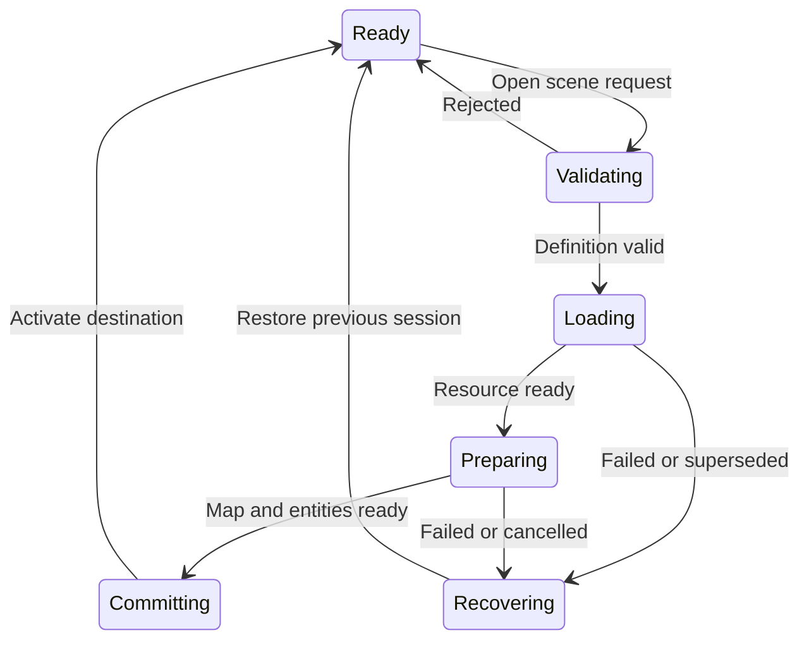

# Scene creation and management design

Status: Proposed, 2026-09-11. Names introduced below are proposed contracts, not existing APIs. Existing generator and navigation entry points remain adapters during migration.

## Current workflow

The dock creates a starter project through `BeepGenreGenerator`, persists `game_info.tres`, and copies shared and genre scenes into game-owned directories. `BeepScreenGenerator` creates a screen and matching C# script. Build before opening a newly generated C# scene. Drift checking compares generated copies with addon templates; an addon update does not automatically update those copies.

At runtime, `GameApp` owns the session and its services. `SceneNav` routes screens, while `MainGameComponent` and `LevelLoaderComponent` each manage level instantiation. Keep screen overlays distinct from replacing the playable world: pausing a scene must not start a new session, change its world identity or reset its terrain.

## Proposed authoring flow

1. **Create project:** choose genre, theme and a starter map mode. Default to the selected genre plus required shared assets; offer an explicit all-genres sample installation.
2. **Preview outputs:** list paths as Create / Preserve / Update / Conflict, show dependencies and changed settings. Validate names, paths and the whole scene/script pair before writing.
3. **Commit:** stage outputs, validate them, retain recoverable originals for replacements, and publish only when the operation can finish. A failed commit leaves the previous project usable and reports exactly what happened.
4. **Create a scene:** choose Screen, Gameplay Shell, Level, Terrain Map, Actor, Prop or Encounter. Prefer composition of existing templates; generate a new script only when behavior requires one.
5. **Register:** add stable scene/map identities to the game catalog. Paths remain resolvers rather than save-game identities.
6. **Validate and open:** check imports, script types, required nodes, links and save-key uniqueness, then open the scene or play it through its actual entry route.

## Catalog and ownership

Proposed `SceneDefinition` entries contain `SceneId`, role, display name, PackedScene reference, supported entry modes, optional `MapId`, spawn marker IDs, dependencies and schema version. A project-owned `SceneCatalog` resolves them. Use explicit role-specific scene bindings where needed; a catalog should not become a generic bag that duplicates GameInfo tuning or world state.

Proposed game layout:

```text
res://resources/game/scene_catalog.tres
res://resources/maps/<map_id>/definition.tres
res://resources/maps/<map_id>/published/<revision>/manifest.tres
res://scenes/main/<game_shell>.tscn
res://scenes/maps/<map_id>.tscn
res://scenes/levels/<level_id>.tscn
res://scenes/ui/<screen>.tscn
```

Keep addon templates under `addons/` as distribution sources. Generated game files are editable game assets. Maps do not own the global clock, save manager, menus or input settings. A level can compose a map, encounters and spawn markers. The same map can serve multiple levels without duplicating its definition or session data.

## One transition coordinator

Implement scene transitions as a service owned by GameApp, using the existing save/session barrier. Do not add another autoload. `SceneNav`, `MainGameComponent` and `LevelLoaderComponent` delegate to it while preserving their public methods and standalone-scene behavior.



Each request carries a monotonically increasing transition ID. Late callbacks from superseded requests cannot commit. Load the PackedScene in the background; instantiate and modify nodes on the main thread. Preparing a destination must not allow its `_Ready` methods to start simulation, debit resources or spawn duplicate actors. Add an explicit preparation gate; merely hiding a node or setting process mode does not suppress `_Ready`.

Retain the previous world until destination validation and preparation succeed. At commit, activate the destination, switch save scope and release the old world. If retaining both worlds exceeds a memory budget, use a separately specified unload-first policy with a recovery checkpoint and loading screen. Never imply full rollback if the previous world has already been discarded.

`Ready` means required cells, collision, navigation dependencies, entities and restore work are complete for the initial playable area. Visual background refinement may continue only if it cannot change traversability or spawn placement. Preserve pause/time state on failed transitions. Disable saving and gameplay commands while a world is partially prepared.

## Regeneration and upgrades

Keep SkipExisting as the safe default. Record a generation manifest with generator version, source-template hash, generated-base hash and destination. A changed template is an upgrade candidate, not permission to overwrite an edited scene.

Offer preview, side-by-side replacement and explicit conflict resolution. Use three-way merges only for formats and changes where semantic correctness can be validated. Do not promise arbitrary `.tscn` merges in the first release. Apply inheritance only to templates tested for stable extension points; do not convert every copied scene to inheritance automatically.

## Acceptance examples

- Generate twice in Preserve mode: no user scene/script changes and no duplicate catalog entries.
- Fail midway through screen creation: neither an orphan script nor half a scene replaces the prior pair.
- Rename a scene through the editor: catalog resolution remains valid and stable IDs in saves are unchanged.
- Request level B, then C before B finishes: only C becomes active.
- Fail destination resource loading: old level, pause state and save scope remain usable.
- Open the same map in two independent worlds: their mutable cells, objects and save records never mix.

Delivery: BGB-01, BGB-05, BGB-09 and BGB-10 in the [implementation plan](../../plans/game-builder/IMPLEMENTATION_PLAN.md).
