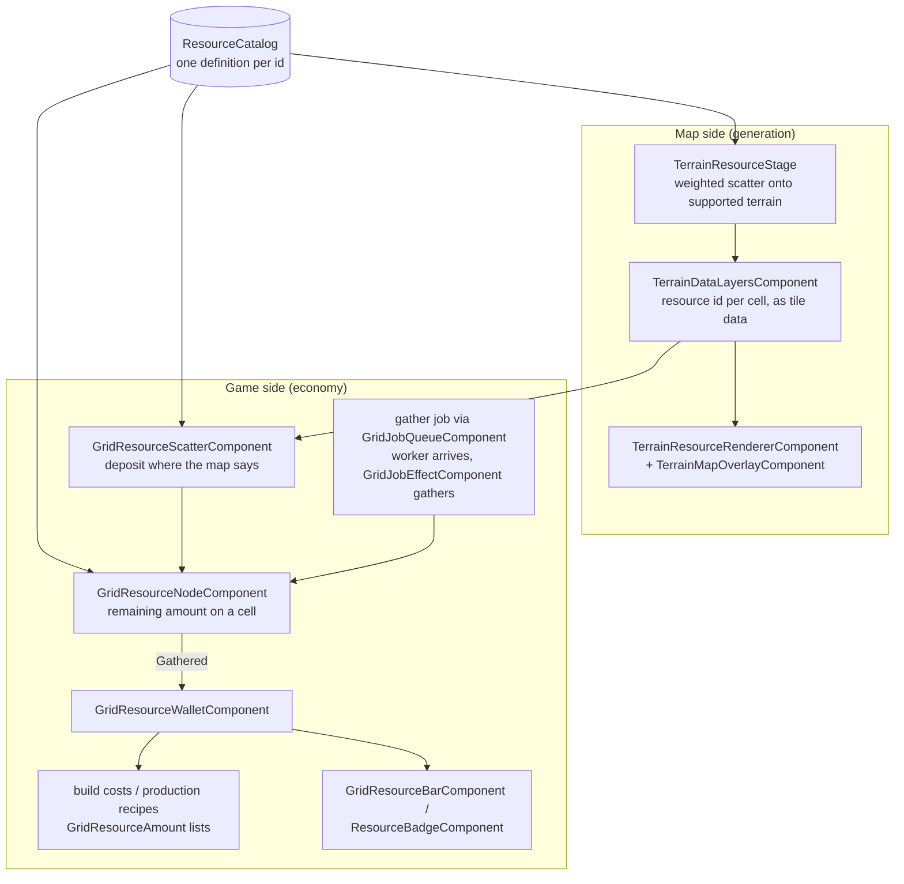

# Resource System — Developer Guide

How a resource travels from "the map decided iron belongs in these hills" to "the wallet says 12 iron", and which class owns each step. Written against the source tree on 2026-09-02.

The system's one rule: **a resource id means the same thing everywhere it appears**. That is what the shared catalog exists for — before it, the generator had a private resource table and the economy had bare strings, so the map could place `crude_oil` while the game had no idea it existed.

## The classes

| Class | Owns |
|---|---|
| `ResourceDefinition` (`Resource`) | One resource, both halves: where it occurs (terrain kinds, weight, relief requirement) and how it is gathered (deposit amount, yield per gather, gather seconds, job kind, per-resource `NodeScene`, cell occupancy). |
| `ResourceCatalog` (`Resource`) | THE set a world uses — id lookup, category, display name, per-terrain queries. Author one to replace the 4X table with ore-and-lumber. |
| `ResourceCatalogs` (static) | The three shipped sets — Historical, OilAndGas, SpaceExploration — plus `FindAnywhere` for ids off a saved map generated under a different set. |
| `TerrainResourceStage` | Generation: scatters catalog resources onto eligible tiles, weighted and spaced, deterministic per seed. |
| `TerrainDataLayersComponent` | Publishes per-cell resource ids as tile data — the durable form a saved map keeps. |
| `TerrainResourceRendererComponent` / `TerrainMapOverlayComponent` | Draw resources: icon sheets per shipped set (or a custom sheet + order), and category-colored markers. |
| `GridResourceScatterComponent` | Turns published map resources into gatherable deposit nodes (or seeded random scatter when no map data exists). |
| `GridResourceNodeComponent` | One deposit: its cell, its remaining amount, gather-to-wallet, depletion, cell occupancy. |
| `GridResourceAmount` (`Resource`) | id + quantity, used by build costs, recipes, starting balances. |
| `GridResourceWalletComponent` | The settlement's balances: afford/spend/refund, change signals, save participation. |
| `GridResourceBarComponent` / `ResourceBadgeComponent` | HUD readouts — the grid bar binds labels per id; the badge is the game-styled icon-plus-capsule readout. |
| `GridProductionComponent` + `GridProductionRecipe` | Converts wallet resources over time. |

## The flow

## Ownership, precisely

- **What a resource *is*** — the catalog. Assign the same `ResourceCatalog` to `TerrainGeneratorComponent.Resources`, `GridResourceScatterComponent.Catalog`, and each `GridResourceNodeComponent.Catalog`. Left empty, the generator's `ResourceSet` enum picks a shipped catalog.
- **Where deposits stand** — the map. Point the scatter's `DataLayersPath` at `TerrainDataLayersComponent` and a cell holds a deposit because generation put a resource there, not because a second random roll agreed. Ids the catalog does not list are shown on the map but get no deposit — visible geology the game has no use for.
- **A deposit's rules** — the catalog definition for its id: full amount, yield per gather, gather seconds, job kind, whether it occupies its cell, and its `NodeScene` (a tree scene for wood, a rock for stone; the scatter's single `ResourceScene` is the fallback). The node's own exports apply only to ids the catalog does not define.
- **This deposit's state** — the node: which cell, how much is left, depleted or not.
- **Balances** — the wallet, and only the wallet. Costs and yields are lists of `GridResourceAmount`; ids are normalized lowercase.

## Categories and color

`ResourceCategory` (Bonus / Luxury / Strategic) drives overlay marker color. The overlay asks the generator's actual catalog first and falls back to `ResourceCatalogs.FindAnywhere` only for ids off a saved map generated under a different set — so a custom catalog's categories are honored, not silently painted as Bonus.

## Icons

`TerrainResourceRendererComponent.IconSource = FollowGenerator` uses the bundled sheet for whatever `ResourceSet` the generator is on (sheet + frame order are documented in the component). A game with a custom catalog switches to `Custom` and supplies its own sheet, grid, and `IconOrder`; an id absent from the order is simply not drawn — never substituted with the wrong picture.

## Saved maps

The published data layers, the deposits, and the wallet all survive without the generator: `TerrainDataLayersComponent` layers are real TileMapLayers saved with the scene, deposits capture/restore their cell and remaining amount, and the wallet participates in the addon save system under its `SaveKey`. `ResourceCatalogs.FindAnywhere` exists precisely for a map re-opened under a different `ResourceSet`.
