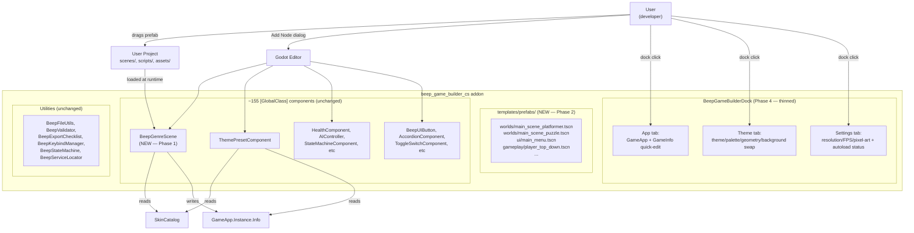

# Component-First Refactor — Design Spec

**Date:** 2026-07-13
**Status:** Approved (brainstorming complete)
**Owner:** beep_game_builder_cs
**Scope:** Major refactor — remove all *Generator classes, ship component-only scene templates, thin the editor dock.

---

## 1. Context

`beep_game_builder_cs` currently has **~10 generator classes** (`BeepGenreGenerator`, `BeepSceneGenerator`, `BeepScriptGenerator`, `BeepShaderGenerator`, `BeepTweenGenerator`, `BeepParticleGenerator`, `BeepProjectileGenerator`, `BeepProjectGenerator`, `BeepInputMapGenerator`, `BeepProjectDefaults`) that produce scenes, scripts, shaders, tweens, particles, projectiles, folder scaffolds, input maps, and project settings on demand from editor buttons. Plus an `OnStarter` method on the dock and the `BeepGameBuilderDock.Genres.cs` partial. All are antipatterns in modern Godot 4.7.

The remainder of `core/` (~28 utility/data classes like `BeepFileUtils`, `BeepValidator`, `BeepKeybindManager`, `BeepStateMachine`, `GameInfo`, etc.) stays — those are runtime helpers, not generators.

Per user direction: **everything must be a component**. Generators are an antipattern in modern Godot 4.7 — they create opaque content the user can't easily inspect, edit, or version-control.

The addon already has **~155 `[GlobalClass]` component classes** (102 in `ecs/`, 53 in `ecs/ui/`). Godot's native **Add Node** dialog already categorizes these and lets users drag them into scenes. The dock's job reduces to **project-level state** (GameApp + GameInfo + theme settings), NOT component discovery.

### Goals

- **No new browser UI** — Godot's Add Node dialog is already the component registry.
- **All scenes are editable `.tscn` files** the user owns.
- **Strict migration**: build new prefab scenes first, mark old generators `[Obsolete]`, THEN delete.
- **The dock becomes thin**: 3 tabs (App / Theme / Settings).

### Non-goals

- No new GDScript UI — only what Godot already provides.
- No scripted setup phase — users drag-and-drop prefabs manually.
- No cloud / marketplace / shareable themes.
- No new component taxonomy — existing `BeepXxxComponent` naming stays.

---

## 2. Architecture

### 2.1 Today vs. tomorrow

| Today | Tomorrow |
|-------|----------|
| ~10 `Beep*Generator` + `OnStarter` + Genres partial write `.tscn` / `.gd` files | 0 generators. Shipped `.tscn` templates ARE the deliverable. |
| 11-tab dock (Project/Scenes/Characters/Shaders/Tweens/Particles/Projectiles/Components/Validation/Export/Genres) | 3-tab dock (App / Theme / Settings) |
| ~58 generator-written templates in `templates/{scenes,scripts}/` | ~38 hand-written component-only templates in `templates/prefabs/` |
| `BeepGenreGenerator.CreateProject(genreId, gameInfo)` is the entry point | `BeepGenreScene` component (drop in scene, set GenreId) is the entry point |
| Editor must click buttons to assemble a project | User drags prefabs into scenes; Godot's native Add Node dialog for inline components |

### 2.2 The new architecture (one diagram)



### 2.3 The single replacement for `BeepGenreGenerator`

`BeepGenreScene` is a `[Tool] [GlobalClass] partial class : Node`. Drop it into a scene root, set `GenreId`, run. It:

1. Looks up the genre in `SkinCatalog`.
2. Applies `genre.DefaultTheme`, `genre.tuning{}`, `genre.MainScene` to `GameApp.Instance.Info`.
3. Finds the sibling `ThemePresetComponent` (if any) and drives it.
4. Emits `GenreApplied` signal.

This is **one** component replacing `BeepGenreGenerator.CreateProject`, `BeepGenreGenerator.StampProject`, `BeepGenreGenerator.ApplyTuning`, and `BeepGameBuilderDock.Genres.AddGenreSection`.

### 2.4 Component-only scene template rules

Every prefab follows four rules:

1. **Zero inline scripts.** The only scripts attached are `[GlobalClass]` C# classes or GDScript classes that ship in the addon. No `.gd` files inside `templates/prefabs/`.
2. **Zero raw resource embeds** unless they ship with the addon.
3. **Editable exports.** Every knob is `[Export]` on a `[GlobalClass]` component, not a literal in the scene.
4. **Compositional.** A complex prefab composes multiple `[GlobalClass]` children.

### 2.5 Directory layout (new)

```
addons/beep_game_builder_cs/
├── core/                                   ← shrinks to ~10 utility files; ~10 generator files deleted
├── ecs/
│   ├── BeepGenreScene.cs                   ← NEW (Phase 1)
│   ├── GameApp.cs                          ← unchanged
│   ├── EntityComponent.cs                  ← unchanged
│   └── ... (~100 more components, unchanged)
├── ecs/ui/
│   ├── ThemePresetComponent.cs             ← unchanged
│   ├── ThemePresetComponent.NodeTheming.cs ← unchanged
│   ├── SkinCatalog.cs                      ← unchanged
│   ├── ... (~50 more UI components, unchanged)
├── ui/
│   └── BeepGameBuilderDock.cs              ← REWRITTEN (3 tabs only)
├── templates/
│   └── prefabs/                            ← NEW (Phase 2)
│       ├── index.json
│       ├── README.md
│       ├── ui/        (main_menu, pause_menu, settings_menu, hud, game_over, themed_button, title_label)
│       ├── gameplay/  (player_*, enemy_*, npc, pickup_item, moving_platform, checkpoint, door_switch, turret, camera_follow)
│       ├── worlds/    (main_scene_<genre>.tscn × 4)
│       ├── systems/   (weather, day_night, inventory, dialog, projectile_spawner, particle_emitter, tween_runner, screen_transition)
│       └── shared/    (game_root, audio_bus, ui_root, save_manager)
└── README.md                               ← updated (Phase 5)
```

---

## 3. Components

### 3.1 `BeepGenreScene` (Phase 1, NEW)

**File:** `addons/beep_game_builder_cs/ecs/BeepGenreScene.cs`

```csharp
namespace Beep.ECS;

[Tool] [GlobalClass]
public partial class BeepGenreScene : Node
{
    [Export] public string GenreId { get; set; } = "";
    [Export] public string DefaultThemePreset { get; set; } = "";
    [Export] public string PaletteName { get; set; } = "Default";
    [Export] public string GeometryProfileName { get; set; } = "As-Authored";
    [Export] public string GameName { get; set; } = "";
    [Export] public bool RegisterAsMainScene { get; set; } = true;

    [Signal] public delegate void GenreAppliedEventHandler();

    public override void _Ready()
    {
        if (Engine.IsEditorHint()) return;
        var genre = Beep.ECS.UI.SkinCatalog.GetGenre(GenreId);
        if (genre == null) { GD.PushWarning($"[BeepGenreScene] Genre '{GenreId}' not found."); return; }
        var app = GameApp.Instance;
        if (app?.Info == null) return;

        app.Info.Genre = GameBuilder.GameInfo.GenreFromId(GenreId);
        if (string.IsNullOrEmpty(DefaultThemePreset)) app.Info.DefaultThemePreset = genre.DefaultTheme;
        else app.Info.DefaultThemePreset = DefaultThemePreset;
        if (!string.IsNullOrEmpty(PaletteName)) app.Info.PaletteName = PaletteName;
        if (!string.IsNullOrEmpty(GeometryProfileName)) app.Info.GeometryProfileName = GeometryProfileName;
        ApplyTuning(app.Info, genre);
        if (RegisterAsMainScene && Owner is Node owner) app.Info.GameScenePath = owner.SceneFilePath;

        var theme = GetParent()?.GetChildren()
            .OfType<Beep.ECS.UI.ThemePresetComponent>().FirstOrDefault();
        if (theme != null)
        {
            theme.GenreName = GenreId;
            theme.PresetName = app.Info.DefaultThemePreset;
            theme.PaletteName = app.Info.PaletteName;
            theme.GeometryProfileName = app.Info.GeometryProfileName;
        }
        EmitSignal(SignalName.GenreApplied);
    }

    public void ApplyGenre() => _Ready();   // public re-entry

    private static void ApplyTuning(GameBuilder.GameInfo info, Beep.ECS.UI.GenreDef genre)
    {
        if (genre.Tuning.Count == 0) return;
        if (genre.Tuning.TryGetValue("gravity", out var g)) info.Gravity = g.AsSingle();
        if (genre.Tuning.TryGetValue("jump_velocity", out var j)) info.JumpVelocity = j.AsSingle();
        if (genre.Tuning.TryGetValue("move_speed", out var m)) info.MoveSpeed = m.AsSingle();
        if (genre.Tuning.TryGetValue("fire_rate", out var f)) info.FireRate = f.AsSingle();
        if (genre.Tuning.TryGetValue("grid_width", out var gw)) info.GridWidth = gw.AsInt32();
        if (genre.Tuning.TryGetValue("grid_height", out var gh)) info.GridHeight = gh.AsInt32();
        if (genre.Tuning.TryGetValue("target_score", out var ts)) info.TargetScore = ts.AsInt32();
    }
}
```

### 3.2 Dock rewrites (Phase 4)

`BeepGameBuilderDock.cs` becomes a thin shell:

```csharp
public override void _Ready()
{
    Name = "Beep Game Builder";
    BuildUI();
}

private void BuildUI()
{
    var tabs = new TabContainer { ... };
    AddChild(tabs);
    AddAppTab(tabs);
    AddThemeTab(tabs);
    AddSettingsTab(tabs);
    _output = new TextEdit { ... };
    AddChild(_output);
}
```

Methods removed (call sites gone too):
- `AddProjectTab`, `AddScenesTab`, `AddCharactersTab`, `AddShadersTab`, `AddTweensTab`, `AddParticlesTab`, `AddProjectilesTab`, `AddComponentsTab`, `AddValidationTab`, `AddExportTab`, `OnStarter`
- Whole file `BeepGameBuilderDock.Genres.cs` deleted

### 3.3 Prefab index schema (Phase 5)

`addons/beep_game_builder_cs/templates/prefabs/index.json`:

```json
{
  "version": 1,
  "categories": [
    {
      "name": "ui",
      "display_name": "UI Scenes",
      "prefabs": [
        {
          "id": "main_menu",
          "path": "ui/main_menu.tscn",
          "display_name": "Main Menu",
          "description": "Title + Start/Options/Quit. Drops into a UI root.",
          "requires": ["BeepGenreScene", "ThemePresetComponent"]
        }
      ]
    }
  ]
}
```

---

## 4. Data flow

### 4.1 Boot path with new architecture

```
User creates new scene
    → drag prefabs/worlds/main_scene_platformer.tscn into res://scenes/main.tscn
    → open scene in editor — root node = MainScene (Node2D)
        ├─ BeepGenreScene  (GenreId="platformer")
        ├─ ThemePresetComponent (ThemePreset, PaletteName, GeometryProfileName blank — driven by GameApp)
        ├─ Player (instance of prefabs/gameplay/player_platformer.tscn)
        │   └─ TopDownController / PlatformerController, HealthComponent, ...
        └─ HUD (instance of prefabs/ui/hud.tscn)
            └─ HealthBarComponent, ScoreDisplayComponent, ...
User runs scene
    → BeepGenreScene._Ready reads SkinCatalog.GetGenre("platformer")
    → applies tuning to GameApp.Instance.Info
    → ThemePresetComponent._Ready reads GameApp.Instance.Info
        → reads SkinCatalog.GetTheme/GetGeometry
        → builds Theme + applies to root subtree
    → TopDownController._Ready / PlatformerController._Ready (entity components wire themselves)
    → HUD components wire themselves
    → scene runs
```

### 4.2 What the dock's App tab does

```
User opens dock → App tab
    → Dock reads GameApp.Instance?.Info
    → If null → display "GameApp autoload not registered" warning + link to README section on setup
    → If present → display every GameInfo field as an editable control
User clicks Save → ResourceSaver.Save(info, GameInfo.TresPath) + Log("Saved game_info.tres")
User clicks Apply Live → walk SceneTree, call ApplyTheme() on every ThemePresetComponent found
```

### 4.3 What the dock's Theme tab does

```
User opens dock → Theme tab
    → Read SkinCatalog.AllGenres → populate Genre dropdown
    → Read selected genre's themes → populate Theme dropdown
    → Read selected theme's palettes → populate Palette dropdown
    → Read selected genre's Geometry → populate Geometry dropdown
    → Read selected geometry's BackgroundImage → show Background toggle
User changes Genre → Theme/Palette/Geometry repopulate
User clicks "Apply to All Components"
    → walk SceneTree, find every ThemePresetComponent
    → for each: set GenreName/PresetName/PaletteName/GeometryProfileName from current dropdowns
    → ApplyTheme() cascade handles the rest
```

---

## 5. Error handling

| Situation | Behavior |
|-----------|----------|
| `BeepGenreScene` with invalid `GenreId` | Push warning; bail. |
| `BeepGenreScene` with no `GameApp` autoload | Push warning; bail. |
| Prefab references a missing `[GlobalClass]` class | Editor warns at scene load; `[Tool]` components show "Invalid" badge. |
| `index.json` is invalid JSON | Builder throws at addon init; dock shows "Prefabs index broken — see logs". |
| Phase 3 `[Obsolete]` user calls removed method | Build warning. Runtime: still works (we don't delete until Phase 6). |
| Phase 6 deletion breaks a user's project | Migration note in README: `BeepGenreScene` is the replacement, scene .tscn is the new project source. |
| `BeepGenreScene._Ready` runs but `GameInfo` autoload missing | Warning + bail. Users see the App tab's autoload-status label. |

---

## 6. Testing strategy

### 6.1 Unit tests (Godot scene harness)

- **`BeepGenreScene.ApplyGenre` populates GameInfo correctly**: drop component into test scene, set GenreId, call ApplyGenre, assert GameApp.Instance.Info reflects genre.json values.
- **`BeepGenreScene` warns on invalid GenreId**: set GenreId="bogus", verify GD.PushWarning was called.
- **`index.json` parses**: load it as `Godot.Collections.Dictionary`, assert every category has at least 1 prefab, every prefab path resolves to a real file.

### 6.2 Integration tests

- **Prefab instantiation**: `ResourceLoader.Load<PackedScene>("res://addons/.../prefabs/ui/main_menu.tscn").Instantiate()` — assert root is a Control with the expected children.
- **Dock renders 3 tabs**: instantiate `BeepGameBuilderDock`, walk children, assert exactly 3 tabs labeled App/Theme/Settings.
- **No regression in component classes**: every existing `~155` component still compiles, still attaches, still exports its fields.

### 6.3 Manual end-to-end (Phase 6 verification)

1. **Brand-new project**: copy only `addons/` into a fresh Godot 4.7 project, enable the plugin, press Build.
2. **Drop world prefab**: drag `prefabs/worlds/main_scene_platformer.tscn` as the main scene.
3. **Run**: themed platformer with player, HUD, genre tuning. No errors.
4. **Editor inspection**: open the scene, click every node — all `[GlobalClass]` components show exports in the Inspector.
5. **No leftover generators**: `find addons -name '*Generator.cs'` returns nothing.

---

## 7. Open risks

1. **Big-bang removal** — Phase 6 deletes 10+ files in one PR. Risk: a user's project still references them. **Mitigation:** Phase 3 marks `[Obsolete]` first, giving users a transition window.
2. **Existing scenes that depend on generator-written paths** — every scene built by `BeepGenreGenerator` references `res://scenes/main/main.tscn` etc. After Phase 6, those files don't exist. **Mitigation:** README migration note; users convert their main scene to a `prefabs/worlds/` instance.
3. **Theme presets hardcoded in scenes** — if a prefab hardcodes `ThemePreset = "Cartoon"`, switching genres may leave a stale preset. **Mitigation:** every prefab's `ThemePresetComponent` is `[Export]` (not hardcoded) and `BeepGenreScene` overrides it in `_Ready`.
4. **`BeepGenreScene` requires GameApp autoload** — first-time users won't have it set up. **Mitigation:** App tab shows autoload status prominently; README has a "First-time setup" section.
5. **`[Tool]` performance** — `_Ready` runs in editor too. `[Tool]` components calling `SkinCatalog.AllGenres` (which lazy-loads) on `_Ready` may slow scene open. **Mitigation:** `BeepGenreScene._Ready` short-circuits via `Engine.IsEditorHint()`; only runtime triggers the full path.

---

## 8. Verification

1. `dotnet build Beep.Godot.sln` → 0 errors at every phase boundary.
2. Brand-new project with the addon → only the new prefabs work; old generator-written scenes break with "script not found" — documented in README.
3. The dock has exactly 3 tabs after Phase 4.
4. Every prefab opens in the editor with all nodes as `[GlobalClass]` components.
5. `index.json` validates; every prefab path resolves.
6. `find addons -name '*Generator.cs'` returns nothing after Phase 6.
7. Cross-addon: `beep_ui` GDScript addon unchanged — still loads, still works.

---

## 9. See also

- [`plans/component-first-refactor.md`](../plans/component-first-refactor.md) — full phase-by-phase implementation plan
- [`docs/SKINNING_THEMING.md`](SKINNING_THEMING.md) — skin pipeline (unchanged)
- [`docs/APP_WORKFLOW.md`](APP_WORKFLOW.md) — old app workflow (will be marked obsolete by Phase 6)