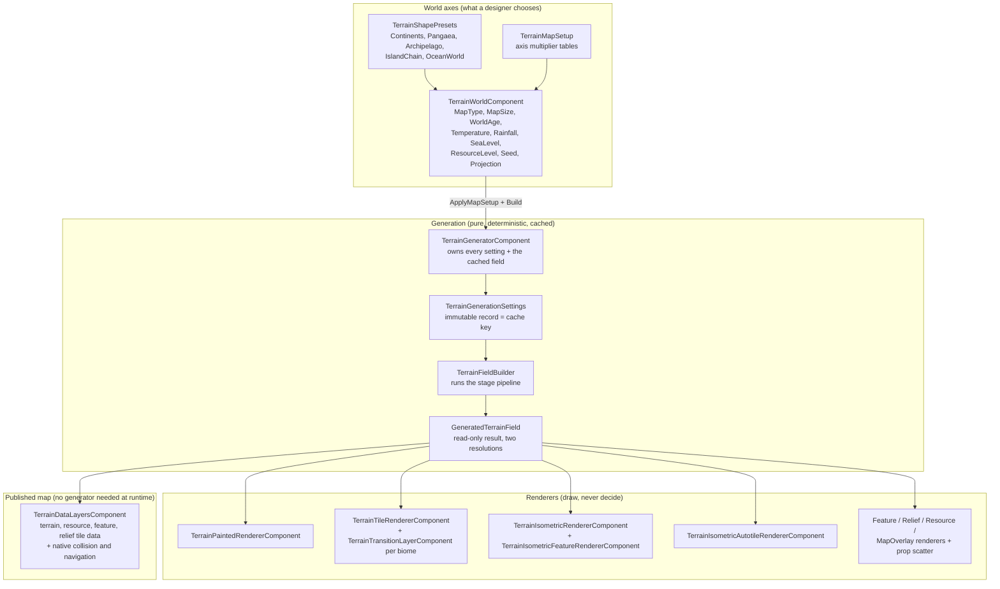
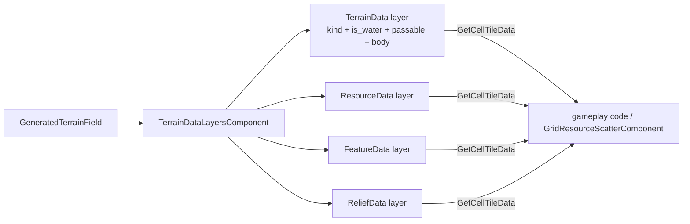

# Terrain Engine — Developer Guide

The connective guide to the `Terrain*` classes in `addons/beep_game_builder_cs/ecs/terrain/`. Every file also has its own reference page in this directory (`docs/terrain-engine/<FileName>.md`); this document explains how they fit together, in the order a map actually comes into being. Written against the source tree on 2026-09-02.

The engine is three layers with one rule between them: **generation decides, renderers draw, data layers publish**. Nothing downstream of the generator ever decides what terrain is — twelve renderers and the gameplay grid all read the same generated field, which is why four projections of one seed can never disagree about the world.

## The big picture



## Generation is a pure function

`TerrainGenerationSettings` is an immutable record built from ~40 exported properties on `TerrainGeneratorComponent`. Two equal settings always produce an identical world, so the generator caches one `GeneratedTerrainField` and rebuilds it only when any setting changes. Renderers on a hot path call the internal `ResolveField()` once per rebuild and use the field's O(1) accessors, rather than paying the settings rebuild-and-compare per cell.

**The ownership contract** (guarded by `tests/addon_contract_scan.ps1`): when a scene drives the generator through `TerrainWorldComponent`, nineteen generator settings are derived from the axes and overwritten on every `Build()` — the eleven `ApplyMapSetup` documents plus `BoundsSize`, `Seed`, `ResourceSet`, `StartAreaRadius`, `StartDistanceScaling`, `UseClimateBiomeMaps`, `UseScaleRules` and `UseCustomClimateSpan` — and `ClimateLatitudeSpan` as well while the world's custom span is on. Set the **axes** on the world component, or drive the generator directly and set its exports — never both.

## The stage pipeline

`TerrainFieldBuilder.Build` runs the stages on a shared mutable `TerrainGenerationBuffer` (struct-of-arrays, at sub-tile *sample* resolution), then reduces to gameplay tiles. Order is load-bearing; each stage reads only what earlier stages settled.

```mermaid
flowchart TB
    L[1 TerrainLandmassStage<br/>grow N separated masses to the coverage target] --> W[2 TerrainWaterStage<br/>carve lake basins, classify ocean vs lake by border reachability]
    W --> E[3 TerrainElevationStage.Apply<br/>coast distance + ridged fractal height]
    E --> ER[4 TerrainErosionStage<br/>stream-power incision + hillslope diffusion, 12 passes]
    ER --> EC[5 TerrainElevationStage.Classify<br/>hills/mountains as percentiles of the eroded field]
    EC --> C[6 TerrainClimateStage<br/>latitude temperature, moisture, rain shadow, dry belts]
    C --> R[7 TerrainRiverStage<br/>D8 drainage network via TerrainFlow, width from accumulation]
    R --> S[8 TerrainShadingStage<br/>hillshade from the elevation gradient]
    S --> B[9 TerrainBiomeStage<br/>Whittaker table -> terrain kind, beach and lake-shore bands]
    B --> CO[10 TerrainCoherenceStage<br/>majority smoothing + dissolve undersized biome regions]
    CO --> TR[11 TerrainTileReductionStage<br/>samples -> one value per gameplay tile]
    TR --> CT[12 TerrainContinentStage<br/>flood-fill landmass ids on the tile grid]
    CT --> SC1[13 TerrainScaleConstraintStage.ApplyTerrain<br/>drain oversized/small lakes, level lone relief, clear short rivers]
    SC1 --> RS[14 TerrainResourceStage<br/>catalog-weighted resources per tile]
    RS --> F[15 TerrainFeatureStage<br/>woods/forest/jungle/marsh/oasis from a vegetation field]
    F --> SC2[16 TerrainScaleConstraintStage.ApplyFeatures<br/>thin lone feature clumps]
    SC2 --> SP[17 TerrainStartPositionStage<br/>fair, separated, continent-spread starts]
    SP --> SA[18 TerrainStartAreaStage<br/>reserved, validated, kitted area per start; off at radius 0]
```



Support pieces the stages share: `TerrainNoiseSet` (ten seeded FastNoiseLite channels), `TerrainFlow` (the one D8 drainage network erosion and rivers both use), `TerrainGeometry` (components, BFS distance, percentiles, the shared `Hash01`), [`TerrainEuclideanDistance`](TerrainEuclideanDistance.md) (the exact Euclidean distance transform, and since VIEW-07 the one owner of the half-sample correction the shoreline stage and the renderers' coast field both measure bands with), and `TerrainScaleRules` (climate span and minimum biome region derived from map size).

Two resolutions matter throughout. The sample field (`TopologySamplesPerCell`² samples per tile, capped at ~1.25M samples) is why coastlines curve inside a tile; `TerrainTileReductionStage` collapses it to the per-tile values a game paths and builds on, taking terrain from the samples that agree with the tile's winning relief band so a tile can never be "snowfield on level ground".

`TerrainMode.Plain` bypasses the stages entirely and fills both resolutions with one preset kind.

## Renderers

All views share `TerrainLayers` — the one stack (seabed, sea, ground, hills, mountains, summits, props, markers) with its z-index scheme — plus `TerrainTextures` (one loader, mip chains guaranteed), `TerrainAuthoring` (`EnsureLayer` creates/reuses/adopts TileMapLayers so generated maps are saved with the scene), `TerrainCoastField` (the shared signed-distance-to-waterline texture every water shader reads), and `TerrainShaderSurface` (the blank one-tile TileSet a per-pixel shader paints on).

**One sea, four views.** The water stack is three files, one per question. [`TerrainWaterLook`](TerrainWaterLook.md) is a `Resource` assigned to `TerrainWorldComponent.WaterLook` and pushed to every renderer by `Draw()`: the thirteen shared dials and four water texture paths, so how the sea *looks* is a fact about the world, not about the view on screen. [`TerrainSeaSurface`](TerrainSeaSurface.md) is one instance per surface-drawing view: the coast field it resolves, the material it adopts-or-creates, and its geometry — `TileBatched` for the flat and isometric-tile seas, `Polygon` for the block view's overscanned quad. [`TerrainWaterMaterial`](TerrainWaterMaterial.md) is the one writer of the shared uniforms, holding each to the shader's own `hint_range`. What stays per view is what is genuinely per surface: the coast window (`CoastRangeTiles`/`CoastDetail`), the transparent-sheet opacities, and the block view's seabed and overscan. Before VIEW-04 (2026-09-16) three renderers exported the same thirteen dials with two sets of defaults and IsometricAutotile had no sea at all.

**A lake ends in a line; the sea does not** (FIX-14, 2026-09-16). Both water shaders take their waterline softness from `open_sea`, the coast field's green-channel flag that already keeps surf off a lake: `terrain_splat.gdshader` mixes `shore_blend_tiles` down to a fifth for a lake, and `iso_water.gdshader` mixes its `on_water` ramp from about half a tile to about a tenth. The sea's edge is deliberately soft — a beach, a wash and surf carry that transition — and a lake has none of them, so one softness for both read as a lake's water smeared into the ground. The same flag decides `lake_opacity` and surf, so this adds no dial: it reads a fact the field already carries. Related, from the same fix: the shoreline stage banks a lake on **any** ground, not only flat, which changed generated maps and required the generation baseline fixture to be re-recorded.

| Projection | Renderer | How it draws |
|---|---|---|
| Painted | `TerrainPaintedRendererComponent` | One shader-blended surface (Factorio-style splat): terrain ids + hillshade + coast field uploaded as textures to `terrain_splat.gdshader`. |
| Tiles | `TerrainTileRendererComponent` | One dual-grid autotiled `TerrainTransitionLayerComponent` + TileMapLayer per biome the map actually contains, stacked by `TerrainLayers`; optional shader sea over the water tiles. |
| Isometric | `TerrainIsometricRendererComponent` | Stacked block layers per elevation level, seabed by BFS water depth, summits above a measured height floor, and the same water shader on an isometric surface. `TerrainIsometricFeatureRendererComponent` stamps vegetation per level so cliffs occlude correctly. |
| IsometricAutotile | `TerrainIsometricAutotileRendererComponent` | Hands runs of cells to Godot's `SetCellsTerrainConnect` against an authored isometric TileSet with painted peering bits; optional shader sea on the same diamond cells, cleared under a `LibraryPack`. |

Grid companions, drawn under Painted, Tiles and IsometricAutotile through the gameplay grid's cell geometry: `TerrainFeatureRendererComponent` (batched tree stamps), `TerrainReliefRendererComponent` (hill/mountain sprites), `TerrainResourceRendererComponent` (icon sheets per resource set), `TerrainMapOverlayComponent` (start rings, start-area borders through `TerrainOverlayEdges`, and underground survey; resources are drawn only by the icon renderer). Also available: `SeededTerrainPropScatterComponent` (deterministic prop stamps). `TerrainWorldComponent.Draw` shows exactly the renderers a projection uses and rebuilds them with the built size — a renderer left out of that dispatch is not "left alone", it keeps whatever the last projection did to it.

**How a view samples its art is its own decision**, written down once in [Texture filters](TEXTURE_FILTERS.md) and stated by each renderer in its own `Rebuild`. Every art-bearing node is mip-aware, because every view minifies as the camera pulls back; what differs is magnification. The prop renderers (feature, relief, isometric feature) sample **nearest** above the chain — `TerrainPropSizing` already caps a stamp at its own art, so the only magnification left is the player's zoom, and interpolating a hard cartoon edge there is a smear. Tile, block and icon views sample linear. The painted surface and every shader sea state a filter that samples nothing: their shaders declare a filter per `sampler2D`.

Standalone authoring tools, not part of the pipeline: `MountainPrefabGeneratorComponent` (instantiates an authored mountain prefab from a manifest), `MountainTileMapLayerGeneratorComponent` (paints a deterministic mountain footprint), `TextureElevationTileSetGeneratorComponent` (bakes an elevated-terrain atlas from textures).

Both feature projections now share bounded, absolute-cell-seeded anchor selection
and woods-frame bindings. The world supplies the seed before visible or hidden
views can rebuild. See [Feature Scatter](FEATURE_SCATTER.md) for fine-water
acceptance, density, artwork selection, tests and footprint limitations.

## The published map

For live builder scenes, `GridCellDataComponent` is authoritative. Navigation,
placement and feature views consume that live store through the grid/terrain
interfaces. The generated data layers below describe the recipe or authored
snapshot; do not use them as the current terrain source after a player edits
the grid. `TerrainWorldComponent.NewWorld()` fills live cells, while redraw and
restore preserve them. There is no separate gameplay world inside a renderer.

`TerrainDataLayersComponent` mirrors the generated field into four invisible TileMapLayers — terrain, resource, feature, relief — whose tiles carry custom data (`terrain`, `resource`, `feature`, `relief`, `is_water`, `passable`, defined once in `TerrainTileSets.Cell`). A game asks cells about themselves through Godot's own `GetCellTileData`/`GetCustomData`, with no generator node required at runtime. The terrain layer also carries **native** per-ground physics and navigation polygons (`TerrainTileSets.DefineBody`/`ShapeCell`): land, water and steep each collide and navigate on their own layer, so whether water stops a character is the game's collision-mask decision, never the map's.



Player starts are published as **ordinary scene nodes**, not as layer data: `TerrainSpawnMarkers` writes a `Spawns` node of `Start_<k>` `Marker2D`s, one per start, each standing on that start's headquarters anchor and carrying `start_index`, `hq_footprint` and (only when the generator reported the start unplayable) `unusable`. `TerrainWorldComponent.SpawnsPath` is the caller: `Draw` rewrites them after the gameplay grid is bound, on every build and redraw. That is the one part of a start a map keeps with no generator and no gameplay baseline, so `GridStartAreaComponent.SpawnsRootPath` reads origins back from the markers in preference to the data layers, while the per-cell reservation (`terrain_start_area`) stays with the Beep profile. The published shape is specified in the [TileMapLayer output contract](../game-builder/TILEMAP_OUTPUT.md#spawns-implemented-feat-09feat-12).

## Editor authoring

Every component is `[Tool]`. `TerrainWorldComponent`'s **Generate map** button builds in the editor; `TerrainAuthoring.Adopt` gives every generated node the edited scene root as owner, so the map is saved with the scene, hand-editable, and shipped. `BuildOnReady` is deliberately ignored in the editor so opening a scene never overwrites an authored map.

## In-scene wiring (the lab pattern)

`terrain_generator_lab.tscn` is the reference: `TerrainLabComponent` (pure UI binder) → `TerrainWorldComponent` → `TerrainGeneratorComponent` → renderers, with `TerrainWorldCameraComponent` framing the result through `PreviewExtent()`/`StartPositionView()` and `TerrainWorldStatusComponent` writing `StatusLine()` to a label. All three of those read the world component, never the renderers, so a game can build its own creation screen on the same component.

## Verification

```powershell
dotnet build Beep.Godot.csproj --no-restore
powershell -ExecutionPolicy Bypass -File tests/addon_contract_scan.ps1
powershell -ExecutionPolicy Bypass -File tests/terrain_guards.ps1 -GodotCommand '<godot-mono-4.7>'
powershell -ExecutionPolicy Bypass -File tests/renderer_reporting_probe.ps1 -GodotCommand '<godot-mono-4.7>'
```

`tests/examples/*.gd` hold the falsifiable per-behavior guards (biomes, landmass counts, resources, renderer reporting); the four `grid_terrain_*_probe.ps1` scripts cover topology, features, lake scatter, and the transition mask table.
